
# M-draw-scad
Drawing bot with MGN rails

---
## Table of Contents
1. [Parts list](#Parts_list)
1. [X Carriage Insert Assembly](#x_carriage_insert_assembly)
1. [X Carriage Assembly](#x_carriage_assembly)
1. [Idler Assembly](#idler_assembly)
1. [Right Y Carriage Assembly](#right_y_carriage_assembly)
1. [Left Y Carriage Assembly](#left_y_carriage_assembly)
1. [X Rail Carriage Assembly](#x_rail_carriage_assembly)
1. [X Rail Left Assembly](#x_rail_left_assembly)
1. [X Rail Assembly](#x_rail_assembly)
1. [Double Idler Assembly](#double_idler_assembly)
1. [Right Motor Pulley Assembly](#right_motor_pulley_assembly)
1. [Right Motor Assembly](#right_motor_assembly)
1. [Left Motor Pulley Assembly](#left_motor_pulley_assembly)
1. [Left Motor Assembly](#left_motor_assembly)
1. [Right Inner Idler Assembly](#right_inner_idler_assembly)
1. [Right Idler Assembly](#right_idler_assembly)
1. [Left Inner Idler Assembly](#left_inner_idler_assembly)
1. [Left Idler Assembly](#left_idler_assembly)
1. [Front Frame Left Assembly](#front_frame_left_assembly)
1. [Front Frame Assembly](#front_frame_assembly)
1. [Back Frame Left Assembly](#back_frame_left_assembly)
1. [Back Frame Assembly](#back_frame_assembly)
1. [Y Rail Assembly](#y_rail_assembly)
1. [Back And Y Assembly](#back_and_y_assembly)
1. [Frame Assembly](#frame_assembly)
1. [Frame Idler Assembly](#frame_idler_assembly)
1. [Frame Motor Assembly](#frame_motor_assembly)
1. [Frame X Rail Assembly](#frame_x_rail_assembly)
1. [Frame X Carriage Assembly](#frame_x_carriage_assembly)
1. [Main Assembly](#main_assembly)

[Top](#TOP)

---

## Parts list
| X&nbsp;Carriage&nbsp;Insert | X&nbsp;Carriage | 8 x Idler | Right&nbsp;Y&nbsp;Carriage | Left&nbsp;Y&nbsp;Carriage | X&nbsp;Rail&nbsp;Carriage | X&nbsp;Rail&nbsp;Left | X&nbsp;Rail | 2 x Double&nbsp;Idler | Right&nbsp;Motor&nbsp;Pulley | Right&nbsp;Motor | Left&nbsp;Motor&nbsp;Pulley | Left&nbsp;Motor | Right&nbsp;Inner&nbsp;Idler | Right&nbsp;Idler | Left&nbsp;Inner&nbsp;Idler | Left&nbsp;Idler | Front&nbsp;Frame&nbsp;Left | Front&nbsp;Frame | Back&nbsp;Frame&nbsp;Left | Back&nbsp;Frame | 2 x Y&nbsp;Rail | Back&nbsp;And&nbsp;Y | Frame | Frame&nbsp;Idler | Frame&nbsp;Motor | Frame&nbsp;X&nbsp;Rail | Frame&nbsp;X&nbsp;Carriage | Main | TOTALS |  |
|---:|---:|---:|---:|---:|---:|---:|---:|---:|---:|---:|---:|---:|---:|---:|---:|---:|---:|---:|---:|---:|---:|---:|---:|---:|---:|---:|---:|---:|---:|:---|
|  |  |  |  |  |  |  |  |  |  |  |  |  |  |  |  |  |  |  |  |  |  |  |  |  |  |  |  |  | | **Vitamins** |
| &nbsp;&nbsp;.&nbsp; | &nbsp;&nbsp;.&nbsp; | &nbsp;&nbsp;16&nbsp; | &nbsp;&nbsp;.&nbsp; | &nbsp;&nbsp;.&nbsp; | &nbsp;&nbsp;.&nbsp; | &nbsp;&nbsp;.&nbsp; | &nbsp;&nbsp;.&nbsp; | &nbsp;&nbsp;8&nbsp; | &nbsp;&nbsp;.&nbsp; | &nbsp;&nbsp;.&nbsp; | &nbsp;&nbsp;.&nbsp; | &nbsp;&nbsp;.&nbsp; | &nbsp;&nbsp;.&nbsp; | &nbsp;&nbsp;.&nbsp; | &nbsp;&nbsp;.&nbsp; | &nbsp;&nbsp;.&nbsp; | &nbsp;&nbsp;.&nbsp; | &nbsp;&nbsp;.&nbsp; | &nbsp;&nbsp;.&nbsp; | &nbsp;&nbsp;.&nbsp; | &nbsp;&nbsp;.&nbsp; | &nbsp;&nbsp;.&nbsp; | &nbsp;&nbsp;.&nbsp; | &nbsp;&nbsp;.&nbsp; | &nbsp;&nbsp;.&nbsp; | &nbsp;&nbsp;.&nbsp; | &nbsp;&nbsp;.&nbsp; | &nbsp;&nbsp;.&nbsp; |  &nbsp;&nbsp;24&nbsp; | &nbsp;&nbsp; Ball bearing F623-2RS 3mm x 10mm x 4mm |
| &nbsp;&nbsp;.&nbsp; | &nbsp;&nbsp;.&nbsp; | &nbsp;&nbsp;.&nbsp; | &nbsp;&nbsp;.&nbsp; | &nbsp;&nbsp;.&nbsp; | &nbsp;&nbsp;.&nbsp; | &nbsp;&nbsp;.&nbsp; | &nbsp;&nbsp;.&nbsp; | &nbsp;&nbsp;.&nbsp; | &nbsp;&nbsp;.&nbsp; | &nbsp;&nbsp;.&nbsp; | &nbsp;&nbsp;.&nbsp; | &nbsp;&nbsp;.&nbsp; | &nbsp;&nbsp;.&nbsp; | &nbsp;&nbsp;.&nbsp; | &nbsp;&nbsp;.&nbsp; | &nbsp;&nbsp;.&nbsp; | &nbsp;&nbsp;.&nbsp; | &nbsp;&nbsp;.&nbsp; | &nbsp;&nbsp;.&nbsp; | &nbsp;&nbsp;.&nbsp; | &nbsp;&nbsp;.&nbsp; | &nbsp;&nbsp;.&nbsp; | &nbsp;&nbsp;.&nbsp; | &nbsp;&nbsp;.&nbsp; | &nbsp;&nbsp;.&nbsp; | &nbsp;&nbsp;.&nbsp; | &nbsp;&nbsp;.&nbsp; | &nbsp;&nbsp;1&nbsp; |  &nbsp;&nbsp;1&nbsp; | &nbsp;&nbsp; Belt GT2 x 6mm x 1524mm |
| &nbsp;&nbsp;.&nbsp; | &nbsp;&nbsp;.&nbsp; | &nbsp;&nbsp;.&nbsp; | &nbsp;&nbsp;.&nbsp; | &nbsp;&nbsp;.&nbsp; | &nbsp;&nbsp;.&nbsp; | &nbsp;&nbsp;.&nbsp; | &nbsp;&nbsp;.&nbsp; | &nbsp;&nbsp;.&nbsp; | &nbsp;&nbsp;.&nbsp; | &nbsp;&nbsp;.&nbsp; | &nbsp;&nbsp;.&nbsp; | &nbsp;&nbsp;.&nbsp; | &nbsp;&nbsp;.&nbsp; | &nbsp;&nbsp;.&nbsp; | &nbsp;&nbsp;.&nbsp; | &nbsp;&nbsp;.&nbsp; | &nbsp;&nbsp;.&nbsp; | &nbsp;&nbsp;.&nbsp; | &nbsp;&nbsp;.&nbsp; | &nbsp;&nbsp;.&nbsp; | &nbsp;&nbsp;.&nbsp; | &nbsp;&nbsp;.&nbsp; | &nbsp;&nbsp;.&nbsp; | &nbsp;&nbsp;.&nbsp; | &nbsp;&nbsp;.&nbsp; | &nbsp;&nbsp;.&nbsp; | &nbsp;&nbsp;.&nbsp; | &nbsp;&nbsp;1&nbsp; |  &nbsp;&nbsp;1&nbsp; | &nbsp;&nbsp; Belt GT2 x 6mm x 1524mm |
| &nbsp;&nbsp;.&nbsp; | &nbsp;&nbsp;.&nbsp; | &nbsp;&nbsp;.&nbsp; | &nbsp;&nbsp;.&nbsp; | &nbsp;&nbsp;.&nbsp; | &nbsp;&nbsp;1&nbsp; | &nbsp;&nbsp;.&nbsp; | &nbsp;&nbsp;.&nbsp; | &nbsp;&nbsp;.&nbsp; | &nbsp;&nbsp;.&nbsp; | &nbsp;&nbsp;.&nbsp; | &nbsp;&nbsp;.&nbsp; | &nbsp;&nbsp;.&nbsp; | &nbsp;&nbsp;.&nbsp; | &nbsp;&nbsp;.&nbsp; | &nbsp;&nbsp;.&nbsp; | &nbsp;&nbsp;.&nbsp; | &nbsp;&nbsp;.&nbsp; | &nbsp;&nbsp;.&nbsp; | &nbsp;&nbsp;.&nbsp; | &nbsp;&nbsp;.&nbsp; | &nbsp;&nbsp;.&nbsp; | &nbsp;&nbsp;.&nbsp; | &nbsp;&nbsp;.&nbsp; | &nbsp;&nbsp;.&nbsp; | &nbsp;&nbsp;.&nbsp; | &nbsp;&nbsp;.&nbsp; | &nbsp;&nbsp;.&nbsp; | &nbsp;&nbsp;.&nbsp; |  &nbsp;&nbsp;1&nbsp; | &nbsp;&nbsp; Extrusion E2020 x 450mm |
| &nbsp;&nbsp;.&nbsp; | &nbsp;&nbsp;.&nbsp; | &nbsp;&nbsp;.&nbsp; | &nbsp;&nbsp;.&nbsp; | &nbsp;&nbsp;.&nbsp; | &nbsp;&nbsp;.&nbsp; | &nbsp;&nbsp;.&nbsp; | &nbsp;&nbsp;.&nbsp; | &nbsp;&nbsp;.&nbsp; | &nbsp;&nbsp;.&nbsp; | &nbsp;&nbsp;.&nbsp; | &nbsp;&nbsp;.&nbsp; | &nbsp;&nbsp;.&nbsp; | &nbsp;&nbsp;.&nbsp; | &nbsp;&nbsp;.&nbsp; | &nbsp;&nbsp;.&nbsp; | &nbsp;&nbsp;.&nbsp; | &nbsp;&nbsp;.&nbsp; | &nbsp;&nbsp;.&nbsp; | &nbsp;&nbsp;.&nbsp; | &nbsp;&nbsp;.&nbsp; | &nbsp;&nbsp;2&nbsp; | &nbsp;&nbsp;.&nbsp; | &nbsp;&nbsp;.&nbsp; | &nbsp;&nbsp;.&nbsp; | &nbsp;&nbsp;.&nbsp; | &nbsp;&nbsp;.&nbsp; | &nbsp;&nbsp;.&nbsp; | &nbsp;&nbsp;.&nbsp; |  &nbsp;&nbsp;2&nbsp; | &nbsp;&nbsp; Extrusion E2040 x 354mm |
| &nbsp;&nbsp;.&nbsp; | &nbsp;&nbsp;.&nbsp; | &nbsp;&nbsp;.&nbsp; | &nbsp;&nbsp;.&nbsp; | &nbsp;&nbsp;.&nbsp; | &nbsp;&nbsp;.&nbsp; | &nbsp;&nbsp;.&nbsp; | &nbsp;&nbsp;.&nbsp; | &nbsp;&nbsp;.&nbsp; | &nbsp;&nbsp;.&nbsp; | &nbsp;&nbsp;.&nbsp; | &nbsp;&nbsp;.&nbsp; | &nbsp;&nbsp;.&nbsp; | &nbsp;&nbsp;.&nbsp; | &nbsp;&nbsp;.&nbsp; | &nbsp;&nbsp;.&nbsp; | &nbsp;&nbsp;.&nbsp; | &nbsp;&nbsp;1&nbsp; | &nbsp;&nbsp;.&nbsp; | &nbsp;&nbsp;1&nbsp; | &nbsp;&nbsp;.&nbsp; | &nbsp;&nbsp;.&nbsp; | &nbsp;&nbsp;.&nbsp; | &nbsp;&nbsp;.&nbsp; | &nbsp;&nbsp;.&nbsp; | &nbsp;&nbsp;.&nbsp; | &nbsp;&nbsp;.&nbsp; | &nbsp;&nbsp;.&nbsp; | &nbsp;&nbsp;.&nbsp; |  &nbsp;&nbsp;2&nbsp; | &nbsp;&nbsp; Extrusion E2040 x 472mm |
| &nbsp;&nbsp;4&nbsp; | &nbsp;&nbsp;.&nbsp; | &nbsp;&nbsp;.&nbsp; | &nbsp;&nbsp;.&nbsp; | &nbsp;&nbsp;.&nbsp; | &nbsp;&nbsp;.&nbsp; | &nbsp;&nbsp;.&nbsp; | &nbsp;&nbsp;.&nbsp; | &nbsp;&nbsp;.&nbsp; | &nbsp;&nbsp;.&nbsp; | &nbsp;&nbsp;.&nbsp; | &nbsp;&nbsp;.&nbsp; | &nbsp;&nbsp;.&nbsp; | &nbsp;&nbsp;.&nbsp; | &nbsp;&nbsp;.&nbsp; | &nbsp;&nbsp;.&nbsp; | &nbsp;&nbsp;.&nbsp; | &nbsp;&nbsp;.&nbsp; | &nbsp;&nbsp;.&nbsp; | &nbsp;&nbsp;.&nbsp; | &nbsp;&nbsp;.&nbsp; | &nbsp;&nbsp;.&nbsp; | &nbsp;&nbsp;.&nbsp; | &nbsp;&nbsp;.&nbsp; | &nbsp;&nbsp;.&nbsp; | &nbsp;&nbsp;.&nbsp; | &nbsp;&nbsp;.&nbsp; | &nbsp;&nbsp;.&nbsp; | &nbsp;&nbsp;.&nbsp; |  &nbsp;&nbsp;4&nbsp; | &nbsp;&nbsp; Heatfit insert M3 x 4mm |
| &nbsp;&nbsp;.&nbsp; | &nbsp;&nbsp;.&nbsp; | &nbsp;&nbsp;.&nbsp; | &nbsp;&nbsp;.&nbsp; | &nbsp;&nbsp;.&nbsp; | &nbsp;&nbsp;1&nbsp; | &nbsp;&nbsp;.&nbsp; | &nbsp;&nbsp;.&nbsp; | &nbsp;&nbsp;.&nbsp; | &nbsp;&nbsp;.&nbsp; | &nbsp;&nbsp;.&nbsp; | &nbsp;&nbsp;.&nbsp; | &nbsp;&nbsp;.&nbsp; | &nbsp;&nbsp;.&nbsp; | &nbsp;&nbsp;.&nbsp; | &nbsp;&nbsp;.&nbsp; | &nbsp;&nbsp;.&nbsp; | &nbsp;&nbsp;.&nbsp; | &nbsp;&nbsp;.&nbsp; | &nbsp;&nbsp;.&nbsp; | &nbsp;&nbsp;.&nbsp; | &nbsp;&nbsp;.&nbsp; | &nbsp;&nbsp;.&nbsp; | &nbsp;&nbsp;.&nbsp; | &nbsp;&nbsp;.&nbsp; | &nbsp;&nbsp;.&nbsp; | &nbsp;&nbsp;.&nbsp; | &nbsp;&nbsp;.&nbsp; | &nbsp;&nbsp;.&nbsp; |  &nbsp;&nbsp;1&nbsp; | &nbsp;&nbsp; Linear rail MGN12 x 400mm |
| &nbsp;&nbsp;.&nbsp; | &nbsp;&nbsp;.&nbsp; | &nbsp;&nbsp;.&nbsp; | &nbsp;&nbsp;.&nbsp; | &nbsp;&nbsp;.&nbsp; | &nbsp;&nbsp;.&nbsp; | &nbsp;&nbsp;.&nbsp; | &nbsp;&nbsp;.&nbsp; | &nbsp;&nbsp;.&nbsp; | &nbsp;&nbsp;.&nbsp; | &nbsp;&nbsp;.&nbsp; | &nbsp;&nbsp;.&nbsp; | &nbsp;&nbsp;.&nbsp; | &nbsp;&nbsp;.&nbsp; | &nbsp;&nbsp;.&nbsp; | &nbsp;&nbsp;.&nbsp; | &nbsp;&nbsp;.&nbsp; | &nbsp;&nbsp;.&nbsp; | &nbsp;&nbsp;.&nbsp; | &nbsp;&nbsp;.&nbsp; | &nbsp;&nbsp;.&nbsp; | &nbsp;&nbsp;2&nbsp; | &nbsp;&nbsp;.&nbsp; | &nbsp;&nbsp;.&nbsp; | &nbsp;&nbsp;.&nbsp; | &nbsp;&nbsp;.&nbsp; | &nbsp;&nbsp;.&nbsp; | &nbsp;&nbsp;.&nbsp; | &nbsp;&nbsp;.&nbsp; |  &nbsp;&nbsp;2&nbsp; | &nbsp;&nbsp; Linear rail MGN15 x 300mm |
| &nbsp;&nbsp;.&nbsp; | &nbsp;&nbsp;.&nbsp; | &nbsp;&nbsp;.&nbsp; | &nbsp;&nbsp;.&nbsp; | &nbsp;&nbsp;.&nbsp; | &nbsp;&nbsp;1&nbsp; | &nbsp;&nbsp;.&nbsp; | &nbsp;&nbsp;.&nbsp; | &nbsp;&nbsp;.&nbsp; | &nbsp;&nbsp;.&nbsp; | &nbsp;&nbsp;.&nbsp; | &nbsp;&nbsp;.&nbsp; | &nbsp;&nbsp;.&nbsp; | &nbsp;&nbsp;.&nbsp; | &nbsp;&nbsp;.&nbsp; | &nbsp;&nbsp;.&nbsp; | &nbsp;&nbsp;.&nbsp; | &nbsp;&nbsp;.&nbsp; | &nbsp;&nbsp;.&nbsp; | &nbsp;&nbsp;.&nbsp; | &nbsp;&nbsp;.&nbsp; | &nbsp;&nbsp;.&nbsp; | &nbsp;&nbsp;.&nbsp; | &nbsp;&nbsp;.&nbsp; | &nbsp;&nbsp;.&nbsp; | &nbsp;&nbsp;.&nbsp; | &nbsp;&nbsp;.&nbsp; | &nbsp;&nbsp;.&nbsp; | &nbsp;&nbsp;.&nbsp; |  &nbsp;&nbsp;1&nbsp; | &nbsp;&nbsp; Linear rail carriage MGN12H |
| &nbsp;&nbsp;.&nbsp; | &nbsp;&nbsp;.&nbsp; | &nbsp;&nbsp;.&nbsp; | &nbsp;&nbsp;.&nbsp; | &nbsp;&nbsp;.&nbsp; | &nbsp;&nbsp;.&nbsp; | &nbsp;&nbsp;.&nbsp; | &nbsp;&nbsp;.&nbsp; | &nbsp;&nbsp;.&nbsp; | &nbsp;&nbsp;.&nbsp; | &nbsp;&nbsp;.&nbsp; | &nbsp;&nbsp;.&nbsp; | &nbsp;&nbsp;.&nbsp; | &nbsp;&nbsp;.&nbsp; | &nbsp;&nbsp;.&nbsp; | &nbsp;&nbsp;.&nbsp; | &nbsp;&nbsp;.&nbsp; | &nbsp;&nbsp;.&nbsp; | &nbsp;&nbsp;.&nbsp; | &nbsp;&nbsp;.&nbsp; | &nbsp;&nbsp;.&nbsp; | &nbsp;&nbsp;2&nbsp; | &nbsp;&nbsp;.&nbsp; | &nbsp;&nbsp;.&nbsp; | &nbsp;&nbsp;.&nbsp; | &nbsp;&nbsp;.&nbsp; | &nbsp;&nbsp;.&nbsp; | &nbsp;&nbsp;.&nbsp; | &nbsp;&nbsp;.&nbsp; |  &nbsp;&nbsp;2&nbsp; | &nbsp;&nbsp; Linear rail carriage MGN15H |
| &nbsp;&nbsp;.&nbsp; | &nbsp;&nbsp;.&nbsp; | &nbsp;&nbsp;.&nbsp; | &nbsp;&nbsp;.&nbsp; | &nbsp;&nbsp;.&nbsp; | &nbsp;&nbsp;16&nbsp; | &nbsp;&nbsp;2&nbsp; | &nbsp;&nbsp;2&nbsp; | &nbsp;&nbsp;.&nbsp; | &nbsp;&nbsp;.&nbsp; | &nbsp;&nbsp;.&nbsp; | &nbsp;&nbsp;.&nbsp; | &nbsp;&nbsp;.&nbsp; | &nbsp;&nbsp;.&nbsp; | &nbsp;&nbsp;.&nbsp; | &nbsp;&nbsp;.&nbsp; | &nbsp;&nbsp;.&nbsp; | &nbsp;&nbsp;.&nbsp; | &nbsp;&nbsp;.&nbsp; | &nbsp;&nbsp;.&nbsp; | &nbsp;&nbsp;.&nbsp; | &nbsp;&nbsp;16&nbsp; | &nbsp;&nbsp;.&nbsp; | &nbsp;&nbsp;.&nbsp; | &nbsp;&nbsp;.&nbsp; | &nbsp;&nbsp;.&nbsp; | &nbsp;&nbsp;.&nbsp; | &nbsp;&nbsp;.&nbsp; | &nbsp;&nbsp;.&nbsp; |  &nbsp;&nbsp;36&nbsp; | &nbsp;&nbsp; Nut M3 sliding T |
| &nbsp;&nbsp;.&nbsp; | &nbsp;&nbsp;.&nbsp; | &nbsp;&nbsp;.&nbsp; | &nbsp;&nbsp;.&nbsp; | &nbsp;&nbsp;.&nbsp; | &nbsp;&nbsp;.&nbsp; | &nbsp;&nbsp;.&nbsp; | &nbsp;&nbsp;.&nbsp; | &nbsp;&nbsp;.&nbsp; | &nbsp;&nbsp;.&nbsp; | &nbsp;&nbsp;.&nbsp; | &nbsp;&nbsp;.&nbsp; | &nbsp;&nbsp;.&nbsp; | &nbsp;&nbsp;.&nbsp; | &nbsp;&nbsp;.&nbsp; | &nbsp;&nbsp;.&nbsp; | &nbsp;&nbsp;.&nbsp; | &nbsp;&nbsp;4&nbsp; | &nbsp;&nbsp;4&nbsp; | &nbsp;&nbsp;7&nbsp; | &nbsp;&nbsp;7&nbsp; | &nbsp;&nbsp;.&nbsp; | &nbsp;&nbsp;2&nbsp; | &nbsp;&nbsp;2&nbsp; | &nbsp;&nbsp;.&nbsp; | &nbsp;&nbsp;.&nbsp; | &nbsp;&nbsp;.&nbsp; | &nbsp;&nbsp;.&nbsp; | &nbsp;&nbsp;.&nbsp; |  &nbsp;&nbsp;26&nbsp; | &nbsp;&nbsp; Nut M4 sliding T |
| &nbsp;&nbsp;.&nbsp; | &nbsp;&nbsp;.&nbsp; | &nbsp;&nbsp;.&nbsp; | &nbsp;&nbsp;2&nbsp; | &nbsp;&nbsp;2&nbsp; | &nbsp;&nbsp;.&nbsp; | &nbsp;&nbsp;.&nbsp; | &nbsp;&nbsp;.&nbsp; | &nbsp;&nbsp;.&nbsp; | &nbsp;&nbsp;.&nbsp; | &nbsp;&nbsp;.&nbsp; | &nbsp;&nbsp;.&nbsp; | &nbsp;&nbsp;.&nbsp; | &nbsp;&nbsp;.&nbsp; | &nbsp;&nbsp;.&nbsp; | &nbsp;&nbsp;.&nbsp; | &nbsp;&nbsp;.&nbsp; | &nbsp;&nbsp;.&nbsp; | &nbsp;&nbsp;.&nbsp; | &nbsp;&nbsp;.&nbsp; | &nbsp;&nbsp;.&nbsp; | &nbsp;&nbsp;.&nbsp; | &nbsp;&nbsp;.&nbsp; | &nbsp;&nbsp;.&nbsp; | &nbsp;&nbsp;.&nbsp; | &nbsp;&nbsp;.&nbsp; | &nbsp;&nbsp;.&nbsp; | &nbsp;&nbsp;.&nbsp; | &nbsp;&nbsp;.&nbsp; |  &nbsp;&nbsp;4&nbsp; | &nbsp;&nbsp; Nut M4 x 3.2mm  |
| &nbsp;&nbsp;.&nbsp; | &nbsp;&nbsp;.&nbsp; | &nbsp;&nbsp;.&nbsp; | &nbsp;&nbsp;.&nbsp; | &nbsp;&nbsp;.&nbsp; | &nbsp;&nbsp;.&nbsp; | &nbsp;&nbsp;.&nbsp; | &nbsp;&nbsp;.&nbsp; | &nbsp;&nbsp;.&nbsp; | &nbsp;&nbsp;.&nbsp; | &nbsp;&nbsp;.&nbsp; | &nbsp;&nbsp;.&nbsp; | &nbsp;&nbsp;.&nbsp; | &nbsp;&nbsp;.&nbsp; | &nbsp;&nbsp;2&nbsp; | &nbsp;&nbsp;.&nbsp; | &nbsp;&nbsp;2&nbsp; | &nbsp;&nbsp;.&nbsp; | &nbsp;&nbsp;.&nbsp; | &nbsp;&nbsp;.&nbsp; | &nbsp;&nbsp;.&nbsp; | &nbsp;&nbsp;.&nbsp; | &nbsp;&nbsp;.&nbsp; | &nbsp;&nbsp;.&nbsp; | &nbsp;&nbsp;.&nbsp; | &nbsp;&nbsp;.&nbsp; | &nbsp;&nbsp;.&nbsp; | &nbsp;&nbsp;.&nbsp; | &nbsp;&nbsp;.&nbsp; |  &nbsp;&nbsp;4&nbsp; | &nbsp;&nbsp; Nut M4 x 3.2mm  |
| &nbsp;&nbsp;.&nbsp; | &nbsp;&nbsp;.&nbsp; | &nbsp;&nbsp;.&nbsp; | &nbsp;&nbsp;.&nbsp; | &nbsp;&nbsp;.&nbsp; | &nbsp;&nbsp;.&nbsp; | &nbsp;&nbsp;.&nbsp; | &nbsp;&nbsp;.&nbsp; | &nbsp;&nbsp;.&nbsp; | &nbsp;&nbsp;1&nbsp; | &nbsp;&nbsp;.&nbsp; | &nbsp;&nbsp;1&nbsp; | &nbsp;&nbsp;.&nbsp; | &nbsp;&nbsp;.&nbsp; | &nbsp;&nbsp;.&nbsp; | &nbsp;&nbsp;.&nbsp; | &nbsp;&nbsp;.&nbsp; | &nbsp;&nbsp;.&nbsp; | &nbsp;&nbsp;.&nbsp; | &nbsp;&nbsp;.&nbsp; | &nbsp;&nbsp;.&nbsp; | &nbsp;&nbsp;.&nbsp; | &nbsp;&nbsp;.&nbsp; | &nbsp;&nbsp;.&nbsp; | &nbsp;&nbsp;.&nbsp; | &nbsp;&nbsp;.&nbsp; | &nbsp;&nbsp;.&nbsp; | &nbsp;&nbsp;.&nbsp; | &nbsp;&nbsp;.&nbsp; |  &nbsp;&nbsp;2&nbsp; | &nbsp;&nbsp; Pulley GT2OB 20 teeth |
| &nbsp;&nbsp;.&nbsp; | &nbsp;&nbsp;4&nbsp; | &nbsp;&nbsp;.&nbsp; | &nbsp;&nbsp;.&nbsp; | &nbsp;&nbsp;.&nbsp; | &nbsp;&nbsp;14&nbsp; | &nbsp;&nbsp;.&nbsp; | &nbsp;&nbsp;.&nbsp; | &nbsp;&nbsp;.&nbsp; | &nbsp;&nbsp;.&nbsp; | &nbsp;&nbsp;.&nbsp; | &nbsp;&nbsp;.&nbsp; | &nbsp;&nbsp;.&nbsp; | &nbsp;&nbsp;.&nbsp; | &nbsp;&nbsp;.&nbsp; | &nbsp;&nbsp;.&nbsp; | &nbsp;&nbsp;.&nbsp; | &nbsp;&nbsp;.&nbsp; | &nbsp;&nbsp;.&nbsp; | &nbsp;&nbsp;.&nbsp; | &nbsp;&nbsp;.&nbsp; | &nbsp;&nbsp;12&nbsp; | &nbsp;&nbsp;.&nbsp; | &nbsp;&nbsp;.&nbsp; | &nbsp;&nbsp;.&nbsp; | &nbsp;&nbsp;.&nbsp; | &nbsp;&nbsp;8&nbsp; | &nbsp;&nbsp;4&nbsp; | &nbsp;&nbsp;.&nbsp; |  &nbsp;&nbsp;42&nbsp; | &nbsp;&nbsp; Screw M3 cap x 10mm |
| &nbsp;&nbsp;.&nbsp; | &nbsp;&nbsp;.&nbsp; | &nbsp;&nbsp;.&nbsp; | &nbsp;&nbsp;.&nbsp; | &nbsp;&nbsp;.&nbsp; | &nbsp;&nbsp;.&nbsp; | &nbsp;&nbsp;.&nbsp; | &nbsp;&nbsp;.&nbsp; | &nbsp;&nbsp;.&nbsp; | &nbsp;&nbsp;.&nbsp; | &nbsp;&nbsp;4&nbsp; | &nbsp;&nbsp;.&nbsp; | &nbsp;&nbsp;4&nbsp; | &nbsp;&nbsp;.&nbsp; | &nbsp;&nbsp;.&nbsp; | &nbsp;&nbsp;.&nbsp; | &nbsp;&nbsp;.&nbsp; | &nbsp;&nbsp;.&nbsp; | &nbsp;&nbsp;.&nbsp; | &nbsp;&nbsp;.&nbsp; | &nbsp;&nbsp;.&nbsp; | &nbsp;&nbsp;.&nbsp; | &nbsp;&nbsp;.&nbsp; | &nbsp;&nbsp;.&nbsp; | &nbsp;&nbsp;.&nbsp; | &nbsp;&nbsp;.&nbsp; | &nbsp;&nbsp;.&nbsp; | &nbsp;&nbsp;.&nbsp; | &nbsp;&nbsp;.&nbsp; |  &nbsp;&nbsp;8&nbsp; | &nbsp;&nbsp; Screw M3 cap x 35mm |
| &nbsp;&nbsp;.&nbsp; | &nbsp;&nbsp;.&nbsp; | &nbsp;&nbsp;.&nbsp; | &nbsp;&nbsp;2&nbsp; | &nbsp;&nbsp;2&nbsp; | &nbsp;&nbsp;.&nbsp; | &nbsp;&nbsp;.&nbsp; | &nbsp;&nbsp;.&nbsp; | &nbsp;&nbsp;.&nbsp; | &nbsp;&nbsp;.&nbsp; | &nbsp;&nbsp;.&nbsp; | &nbsp;&nbsp;.&nbsp; | &nbsp;&nbsp;.&nbsp; | &nbsp;&nbsp;.&nbsp; | &nbsp;&nbsp;.&nbsp; | &nbsp;&nbsp;.&nbsp; | &nbsp;&nbsp;.&nbsp; | &nbsp;&nbsp;.&nbsp; | &nbsp;&nbsp;.&nbsp; | &nbsp;&nbsp;.&nbsp; | &nbsp;&nbsp;.&nbsp; | &nbsp;&nbsp;.&nbsp; | &nbsp;&nbsp;.&nbsp; | &nbsp;&nbsp;.&nbsp; | &nbsp;&nbsp;.&nbsp; | &nbsp;&nbsp;.&nbsp; | &nbsp;&nbsp;.&nbsp; | &nbsp;&nbsp;.&nbsp; | &nbsp;&nbsp;.&nbsp; |  &nbsp;&nbsp;4&nbsp; | &nbsp;&nbsp; Screw M3 cap x 45mm |
| &nbsp;&nbsp;.&nbsp; | &nbsp;&nbsp;.&nbsp; | &nbsp;&nbsp;.&nbsp; | &nbsp;&nbsp;.&nbsp; | &nbsp;&nbsp;.&nbsp; | &nbsp;&nbsp;2&nbsp; | &nbsp;&nbsp;.&nbsp; | &nbsp;&nbsp;.&nbsp; | &nbsp;&nbsp;.&nbsp; | &nbsp;&nbsp;.&nbsp; | &nbsp;&nbsp;.&nbsp; | &nbsp;&nbsp;.&nbsp; | &nbsp;&nbsp;.&nbsp; | &nbsp;&nbsp;.&nbsp; | &nbsp;&nbsp;.&nbsp; | &nbsp;&nbsp;.&nbsp; | &nbsp;&nbsp;.&nbsp; | &nbsp;&nbsp;.&nbsp; | &nbsp;&nbsp;.&nbsp; | &nbsp;&nbsp;.&nbsp; | &nbsp;&nbsp;.&nbsp; | &nbsp;&nbsp;4&nbsp; | &nbsp;&nbsp;.&nbsp; | &nbsp;&nbsp;.&nbsp; | &nbsp;&nbsp;.&nbsp; | &nbsp;&nbsp;.&nbsp; | &nbsp;&nbsp;.&nbsp; | &nbsp;&nbsp;.&nbsp; | &nbsp;&nbsp;.&nbsp; |  &nbsp;&nbsp;6&nbsp; | &nbsp;&nbsp; Screw M3 cs cap x 12mm |
| &nbsp;&nbsp;.&nbsp; | &nbsp;&nbsp;.&nbsp; | &nbsp;&nbsp;.&nbsp; | &nbsp;&nbsp;.&nbsp; | &nbsp;&nbsp;.&nbsp; | &nbsp;&nbsp;.&nbsp; | &nbsp;&nbsp;.&nbsp; | &nbsp;&nbsp;.&nbsp; | &nbsp;&nbsp;.&nbsp; | &nbsp;&nbsp;2&nbsp; | &nbsp;&nbsp;.&nbsp; | &nbsp;&nbsp;2&nbsp; | &nbsp;&nbsp;.&nbsp; | &nbsp;&nbsp;.&nbsp; | &nbsp;&nbsp;.&nbsp; | &nbsp;&nbsp;.&nbsp; | &nbsp;&nbsp;.&nbsp; | &nbsp;&nbsp;.&nbsp; | &nbsp;&nbsp;.&nbsp; | &nbsp;&nbsp;.&nbsp; | &nbsp;&nbsp;.&nbsp; | &nbsp;&nbsp;.&nbsp; | &nbsp;&nbsp;.&nbsp; | &nbsp;&nbsp;.&nbsp; | &nbsp;&nbsp;.&nbsp; | &nbsp;&nbsp;.&nbsp; | &nbsp;&nbsp;.&nbsp; | &nbsp;&nbsp;.&nbsp; | &nbsp;&nbsp;.&nbsp; |  &nbsp;&nbsp;4&nbsp; | &nbsp;&nbsp; Screw M3 grub x  6mm |
| &nbsp;&nbsp;.&nbsp; | &nbsp;&nbsp;.&nbsp; | &nbsp;&nbsp;.&nbsp; | &nbsp;&nbsp;.&nbsp; | &nbsp;&nbsp;.&nbsp; | &nbsp;&nbsp;.&nbsp; | &nbsp;&nbsp;.&nbsp; | &nbsp;&nbsp;.&nbsp; | &nbsp;&nbsp;.&nbsp; | &nbsp;&nbsp;.&nbsp; | &nbsp;&nbsp;.&nbsp; | &nbsp;&nbsp;.&nbsp; | &nbsp;&nbsp;.&nbsp; | &nbsp;&nbsp;1&nbsp; | &nbsp;&nbsp;.&nbsp; | &nbsp;&nbsp;1&nbsp; | &nbsp;&nbsp;.&nbsp; | &nbsp;&nbsp;.&nbsp; | &nbsp;&nbsp;.&nbsp; | &nbsp;&nbsp;.&nbsp; | &nbsp;&nbsp;.&nbsp; | &nbsp;&nbsp;.&nbsp; | &nbsp;&nbsp;.&nbsp; | &nbsp;&nbsp;.&nbsp; | &nbsp;&nbsp;.&nbsp; | &nbsp;&nbsp;.&nbsp; | &nbsp;&nbsp;.&nbsp; | &nbsp;&nbsp;.&nbsp; | &nbsp;&nbsp;.&nbsp; |  &nbsp;&nbsp;2&nbsp; | &nbsp;&nbsp; Screw M3 grub x 20mm |
| &nbsp;&nbsp;.&nbsp; | &nbsp;&nbsp;.&nbsp; | &nbsp;&nbsp;.&nbsp; | &nbsp;&nbsp;.&nbsp; | &nbsp;&nbsp;.&nbsp; | &nbsp;&nbsp;.&nbsp; | &nbsp;&nbsp;1&nbsp; | &nbsp;&nbsp;1&nbsp; | &nbsp;&nbsp;.&nbsp; | &nbsp;&nbsp;.&nbsp; | &nbsp;&nbsp;.&nbsp; | &nbsp;&nbsp;.&nbsp; | &nbsp;&nbsp;.&nbsp; | &nbsp;&nbsp;.&nbsp; | &nbsp;&nbsp;.&nbsp; | &nbsp;&nbsp;.&nbsp; | &nbsp;&nbsp;.&nbsp; | &nbsp;&nbsp;1&nbsp; | &nbsp;&nbsp;1&nbsp; | &nbsp;&nbsp;3&nbsp; | &nbsp;&nbsp;3&nbsp; | &nbsp;&nbsp;.&nbsp; | &nbsp;&nbsp;.&nbsp; | &nbsp;&nbsp;.&nbsp; | &nbsp;&nbsp;6&nbsp; | &nbsp;&nbsp;10&nbsp; | &nbsp;&nbsp;.&nbsp; | &nbsp;&nbsp;.&nbsp; | &nbsp;&nbsp;.&nbsp; |  &nbsp;&nbsp;26&nbsp; | &nbsp;&nbsp; Screw M4 flanged x 10mm |
| &nbsp;&nbsp;.&nbsp; | &nbsp;&nbsp;.&nbsp; | &nbsp;&nbsp;.&nbsp; | &nbsp;&nbsp;.&nbsp; | &nbsp;&nbsp;.&nbsp; | &nbsp;&nbsp;.&nbsp; | &nbsp;&nbsp;1&nbsp; | &nbsp;&nbsp;1&nbsp; | &nbsp;&nbsp;.&nbsp; | &nbsp;&nbsp;.&nbsp; | &nbsp;&nbsp;.&nbsp; | &nbsp;&nbsp;.&nbsp; | &nbsp;&nbsp;.&nbsp; | &nbsp;&nbsp;.&nbsp; | &nbsp;&nbsp;.&nbsp; | &nbsp;&nbsp;.&nbsp; | &nbsp;&nbsp;.&nbsp; | &nbsp;&nbsp;.&nbsp; | &nbsp;&nbsp;.&nbsp; | &nbsp;&nbsp;.&nbsp; | &nbsp;&nbsp;.&nbsp; | &nbsp;&nbsp;.&nbsp; | &nbsp;&nbsp;.&nbsp; | &nbsp;&nbsp;.&nbsp; | &nbsp;&nbsp;.&nbsp; | &nbsp;&nbsp;.&nbsp; | &nbsp;&nbsp;.&nbsp; | &nbsp;&nbsp;.&nbsp; | &nbsp;&nbsp;.&nbsp; |  &nbsp;&nbsp;2&nbsp; | &nbsp;&nbsp; Screw M4 flanged x 16mm |
| &nbsp;&nbsp;.&nbsp; | &nbsp;&nbsp;.&nbsp; | &nbsp;&nbsp;.&nbsp; | &nbsp;&nbsp;.&nbsp; | &nbsp;&nbsp;.&nbsp; | &nbsp;&nbsp;.&nbsp; | &nbsp;&nbsp;.&nbsp; | &nbsp;&nbsp;.&nbsp; | &nbsp;&nbsp;.&nbsp; | &nbsp;&nbsp;.&nbsp; | &nbsp;&nbsp;.&nbsp; | &nbsp;&nbsp;.&nbsp; | &nbsp;&nbsp;.&nbsp; | &nbsp;&nbsp;2&nbsp; | &nbsp;&nbsp;.&nbsp; | &nbsp;&nbsp;2&nbsp; | &nbsp;&nbsp;.&nbsp; | &nbsp;&nbsp;.&nbsp; | &nbsp;&nbsp;.&nbsp; | &nbsp;&nbsp;.&nbsp; | &nbsp;&nbsp;.&nbsp; | &nbsp;&nbsp;.&nbsp; | &nbsp;&nbsp;.&nbsp; | &nbsp;&nbsp;.&nbsp; | &nbsp;&nbsp;.&nbsp; | &nbsp;&nbsp;.&nbsp; | &nbsp;&nbsp;.&nbsp; | &nbsp;&nbsp;.&nbsp; | &nbsp;&nbsp;.&nbsp; |  &nbsp;&nbsp;4&nbsp; | &nbsp;&nbsp; Screw M4 flanged x 45mm |
| &nbsp;&nbsp;.&nbsp; | &nbsp;&nbsp;.&nbsp; | &nbsp;&nbsp;.&nbsp; | &nbsp;&nbsp;.&nbsp; | &nbsp;&nbsp;.&nbsp; | &nbsp;&nbsp;.&nbsp; | &nbsp;&nbsp;.&nbsp; | &nbsp;&nbsp;.&nbsp; | &nbsp;&nbsp;.&nbsp; | &nbsp;&nbsp;.&nbsp; | &nbsp;&nbsp;.&nbsp; | &nbsp;&nbsp;.&nbsp; | &nbsp;&nbsp;.&nbsp; | &nbsp;&nbsp;.&nbsp; | &nbsp;&nbsp;.&nbsp; | &nbsp;&nbsp;.&nbsp; | &nbsp;&nbsp;.&nbsp; | &nbsp;&nbsp;.&nbsp; | &nbsp;&nbsp;.&nbsp; | &nbsp;&nbsp;.&nbsp; | &nbsp;&nbsp;.&nbsp; | &nbsp;&nbsp;.&nbsp; | &nbsp;&nbsp;4&nbsp; | &nbsp;&nbsp;2&nbsp; | &nbsp;&nbsp;.&nbsp; | &nbsp;&nbsp;.&nbsp; | &nbsp;&nbsp;.&nbsp; | &nbsp;&nbsp;.&nbsp; | &nbsp;&nbsp;.&nbsp; |  &nbsp;&nbsp;6&nbsp; | &nbsp;&nbsp; Screw M5 flanged x 10mm |
| &nbsp;&nbsp;.&nbsp; | &nbsp;&nbsp;.&nbsp; | &nbsp;&nbsp;.&nbsp; | &nbsp;&nbsp;.&nbsp; | &nbsp;&nbsp;.&nbsp; | &nbsp;&nbsp;.&nbsp; | &nbsp;&nbsp;.&nbsp; | &nbsp;&nbsp;.&nbsp; | &nbsp;&nbsp;.&nbsp; | &nbsp;&nbsp;.&nbsp; | &nbsp;&nbsp;.&nbsp; | &nbsp;&nbsp;.&nbsp; | &nbsp;&nbsp;.&nbsp; | &nbsp;&nbsp;.&nbsp; | &nbsp;&nbsp;.&nbsp; | &nbsp;&nbsp;.&nbsp; | &nbsp;&nbsp;.&nbsp; | &nbsp;&nbsp;1&nbsp; | &nbsp;&nbsp;1&nbsp; | &nbsp;&nbsp;.&nbsp; | &nbsp;&nbsp;.&nbsp; | &nbsp;&nbsp;.&nbsp; | &nbsp;&nbsp;.&nbsp; | &nbsp;&nbsp;2&nbsp; | &nbsp;&nbsp;.&nbsp; | &nbsp;&nbsp;.&nbsp; | &nbsp;&nbsp;.&nbsp; | &nbsp;&nbsp;.&nbsp; | &nbsp;&nbsp;.&nbsp; |  &nbsp;&nbsp;4&nbsp; | &nbsp;&nbsp; Screw M5 low profile x 10mm |
| &nbsp;&nbsp;.&nbsp; | &nbsp;&nbsp;.&nbsp; | &nbsp;&nbsp;.&nbsp; | &nbsp;&nbsp;.&nbsp; | &nbsp;&nbsp;.&nbsp; | &nbsp;&nbsp;.&nbsp; | &nbsp;&nbsp;.&nbsp; | &nbsp;&nbsp;.&nbsp; | &nbsp;&nbsp;.&nbsp; | &nbsp;&nbsp;1&nbsp; | &nbsp;&nbsp;.&nbsp; | &nbsp;&nbsp;1&nbsp; | &nbsp;&nbsp;.&nbsp; | &nbsp;&nbsp;.&nbsp; | &nbsp;&nbsp;.&nbsp; | &nbsp;&nbsp;.&nbsp; | &nbsp;&nbsp;.&nbsp; | &nbsp;&nbsp;.&nbsp; | &nbsp;&nbsp;.&nbsp; | &nbsp;&nbsp;.&nbsp; | &nbsp;&nbsp;.&nbsp; | &nbsp;&nbsp;.&nbsp; | &nbsp;&nbsp;.&nbsp; | &nbsp;&nbsp;.&nbsp; | &nbsp;&nbsp;.&nbsp; | &nbsp;&nbsp;.&nbsp; | &nbsp;&nbsp;.&nbsp; | &nbsp;&nbsp;.&nbsp; | &nbsp;&nbsp;.&nbsp; |  &nbsp;&nbsp;2&nbsp; | &nbsp;&nbsp; Stepper motor NEMA17 x 47mm (5x24 shaft) |
| &nbsp;&nbsp;.&nbsp; | &nbsp;&nbsp;.&nbsp; | &nbsp;&nbsp;24&nbsp; | &nbsp;&nbsp;2&nbsp; | &nbsp;&nbsp;2&nbsp; | &nbsp;&nbsp;.&nbsp; | &nbsp;&nbsp;.&nbsp; | &nbsp;&nbsp;.&nbsp; | &nbsp;&nbsp;14&nbsp; | &nbsp;&nbsp;.&nbsp; | &nbsp;&nbsp;4&nbsp; | &nbsp;&nbsp;.&nbsp; | &nbsp;&nbsp;4&nbsp; | &nbsp;&nbsp;.&nbsp; | &nbsp;&nbsp;.&nbsp; | &nbsp;&nbsp;.&nbsp; | &nbsp;&nbsp;.&nbsp; | &nbsp;&nbsp;.&nbsp; | &nbsp;&nbsp;.&nbsp; | &nbsp;&nbsp;.&nbsp; | &nbsp;&nbsp;.&nbsp; | &nbsp;&nbsp;.&nbsp; | &nbsp;&nbsp;.&nbsp; | &nbsp;&nbsp;.&nbsp; | &nbsp;&nbsp;.&nbsp; | &nbsp;&nbsp;.&nbsp; | &nbsp;&nbsp;8&nbsp; | &nbsp;&nbsp;4&nbsp; | &nbsp;&nbsp;.&nbsp; |  &nbsp;&nbsp;62&nbsp; | &nbsp;&nbsp; Washer  M3 x 7mm x 0.5mm |
| &nbsp;&nbsp;.&nbsp; | &nbsp;&nbsp;.&nbsp; | &nbsp;&nbsp;.&nbsp; | &nbsp;&nbsp;2&nbsp; | &nbsp;&nbsp;2&nbsp; | &nbsp;&nbsp;.&nbsp; | &nbsp;&nbsp;.&nbsp; | &nbsp;&nbsp;.&nbsp; | &nbsp;&nbsp;.&nbsp; | &nbsp;&nbsp;.&nbsp; | &nbsp;&nbsp;.&nbsp; | &nbsp;&nbsp;.&nbsp; | &nbsp;&nbsp;.&nbsp; | &nbsp;&nbsp;.&nbsp; | &nbsp;&nbsp;.&nbsp; | &nbsp;&nbsp;.&nbsp; | &nbsp;&nbsp;.&nbsp; | &nbsp;&nbsp;.&nbsp; | &nbsp;&nbsp;.&nbsp; | &nbsp;&nbsp;.&nbsp; | &nbsp;&nbsp;.&nbsp; | &nbsp;&nbsp;.&nbsp; | &nbsp;&nbsp;.&nbsp; | &nbsp;&nbsp;.&nbsp; | &nbsp;&nbsp;.&nbsp; | &nbsp;&nbsp;.&nbsp; | &nbsp;&nbsp;.&nbsp; | &nbsp;&nbsp;.&nbsp; | &nbsp;&nbsp;.&nbsp; |  &nbsp;&nbsp;4&nbsp; | &nbsp;&nbsp; Washer  M4 x 9mm x 0.8mm |
| &nbsp;&nbsp;4&nbsp; | &nbsp;&nbsp;4&nbsp; | &nbsp;&nbsp;40&nbsp; | &nbsp;&nbsp;8&nbsp; | &nbsp;&nbsp;8&nbsp; | &nbsp;&nbsp;35&nbsp; | &nbsp;&nbsp;4&nbsp; | &nbsp;&nbsp;4&nbsp; | &nbsp;&nbsp;22&nbsp; | &nbsp;&nbsp;4&nbsp; | &nbsp;&nbsp;8&nbsp; | &nbsp;&nbsp;4&nbsp; | &nbsp;&nbsp;8&nbsp; | &nbsp;&nbsp;3&nbsp; | &nbsp;&nbsp;2&nbsp; | &nbsp;&nbsp;3&nbsp; | &nbsp;&nbsp;2&nbsp; | &nbsp;&nbsp;7&nbsp; | &nbsp;&nbsp;6&nbsp; | &nbsp;&nbsp;11&nbsp; | &nbsp;&nbsp;10&nbsp; | &nbsp;&nbsp;38&nbsp; | &nbsp;&nbsp;6&nbsp; | &nbsp;&nbsp;6&nbsp; | &nbsp;&nbsp;6&nbsp; | &nbsp;&nbsp;10&nbsp; | &nbsp;&nbsp;16&nbsp; | &nbsp;&nbsp;8&nbsp; | &nbsp;&nbsp;2&nbsp; | &nbsp;&nbsp;289&nbsp; | &nbsp;&nbsp;Total vitamins count |
|  |  |  |  |  |  |  |  |  |  |  |  |  |  |  |  |  |  |  |  |  |  |  |  |  |  |  |  |  | | **3D printed parts** |
| &nbsp;&nbsp;.&nbsp; | &nbsp;&nbsp;.&nbsp; | &nbsp;&nbsp;.&nbsp; | &nbsp;&nbsp;.&nbsp; | &nbsp;&nbsp;.&nbsp; | &nbsp;&nbsp;.&nbsp; | &nbsp;&nbsp;.&nbsp; | &nbsp;&nbsp;.&nbsp; | &nbsp;&nbsp;.&nbsp; | &nbsp;&nbsp;.&nbsp; | &nbsp;&nbsp;.&nbsp; | &nbsp;&nbsp;.&nbsp; | &nbsp;&nbsp;.&nbsp; | &nbsp;&nbsp;.&nbsp; | &nbsp;&nbsp;.&nbsp; | &nbsp;&nbsp;.&nbsp; | &nbsp;&nbsp;.&nbsp; | &nbsp;&nbsp;.&nbsp; | &nbsp;&nbsp;.&nbsp; | &nbsp;&nbsp;1&nbsp; | &nbsp;&nbsp;.&nbsp; | &nbsp;&nbsp;.&nbsp; | &nbsp;&nbsp;.&nbsp; | &nbsp;&nbsp;.&nbsp; | &nbsp;&nbsp;.&nbsp; | &nbsp;&nbsp;.&nbsp; | &nbsp;&nbsp;.&nbsp; | &nbsp;&nbsp;.&nbsp; | &nbsp;&nbsp;.&nbsp; |  &nbsp;&nbsp;1&nbsp; | &nbsp;&nbsp;left_back_corner.stl |
| &nbsp;&nbsp;.&nbsp; | &nbsp;&nbsp;.&nbsp; | &nbsp;&nbsp;.&nbsp; | &nbsp;&nbsp;.&nbsp; | &nbsp;&nbsp;.&nbsp; | &nbsp;&nbsp;.&nbsp; | &nbsp;&nbsp;.&nbsp; | &nbsp;&nbsp;.&nbsp; | &nbsp;&nbsp;.&nbsp; | &nbsp;&nbsp;.&nbsp; | &nbsp;&nbsp;.&nbsp; | &nbsp;&nbsp;.&nbsp; | &nbsp;&nbsp;.&nbsp; | &nbsp;&nbsp;.&nbsp; | &nbsp;&nbsp;.&nbsp; | &nbsp;&nbsp;.&nbsp; | &nbsp;&nbsp;.&nbsp; | &nbsp;&nbsp;1&nbsp; | &nbsp;&nbsp;.&nbsp; | &nbsp;&nbsp;.&nbsp; | &nbsp;&nbsp;.&nbsp; | &nbsp;&nbsp;.&nbsp; | &nbsp;&nbsp;.&nbsp; | &nbsp;&nbsp;.&nbsp; | &nbsp;&nbsp;.&nbsp; | &nbsp;&nbsp;.&nbsp; | &nbsp;&nbsp;.&nbsp; | &nbsp;&nbsp;.&nbsp; | &nbsp;&nbsp;.&nbsp; |  &nbsp;&nbsp;1&nbsp; | &nbsp;&nbsp;left_front_corner.stl |
| &nbsp;&nbsp;.&nbsp; | &nbsp;&nbsp;.&nbsp; | &nbsp;&nbsp;.&nbsp; | &nbsp;&nbsp;.&nbsp; | &nbsp;&nbsp;.&nbsp; | &nbsp;&nbsp;.&nbsp; | &nbsp;&nbsp;.&nbsp; | &nbsp;&nbsp;.&nbsp; | &nbsp;&nbsp;.&nbsp; | &nbsp;&nbsp;.&nbsp; | &nbsp;&nbsp;.&nbsp; | &nbsp;&nbsp;.&nbsp; | &nbsp;&nbsp;.&nbsp; | &nbsp;&nbsp;.&nbsp; | &nbsp;&nbsp;.&nbsp; | &nbsp;&nbsp;1&nbsp; | &nbsp;&nbsp;.&nbsp; | &nbsp;&nbsp;.&nbsp; | &nbsp;&nbsp;.&nbsp; | &nbsp;&nbsp;.&nbsp; | &nbsp;&nbsp;.&nbsp; | &nbsp;&nbsp;.&nbsp; | &nbsp;&nbsp;.&nbsp; | &nbsp;&nbsp;.&nbsp; | &nbsp;&nbsp;.&nbsp; | &nbsp;&nbsp;.&nbsp; | &nbsp;&nbsp;.&nbsp; | &nbsp;&nbsp;.&nbsp; | &nbsp;&nbsp;.&nbsp; |  &nbsp;&nbsp;1&nbsp; | &nbsp;&nbsp;left_front_idler.stl |
| &nbsp;&nbsp;.&nbsp; | &nbsp;&nbsp;.&nbsp; | &nbsp;&nbsp;.&nbsp; | &nbsp;&nbsp;.&nbsp; | &nbsp;&nbsp;.&nbsp; | &nbsp;&nbsp;.&nbsp; | &nbsp;&nbsp;.&nbsp; | &nbsp;&nbsp;.&nbsp; | &nbsp;&nbsp;.&nbsp; | &nbsp;&nbsp;.&nbsp; | &nbsp;&nbsp;.&nbsp; | &nbsp;&nbsp;.&nbsp; | &nbsp;&nbsp;.&nbsp; | &nbsp;&nbsp;.&nbsp; | &nbsp;&nbsp;.&nbsp; | &nbsp;&nbsp;.&nbsp; | &nbsp;&nbsp;1&nbsp; | &nbsp;&nbsp;.&nbsp; | &nbsp;&nbsp;.&nbsp; | &nbsp;&nbsp;.&nbsp; | &nbsp;&nbsp;.&nbsp; | &nbsp;&nbsp;.&nbsp; | &nbsp;&nbsp;.&nbsp; | &nbsp;&nbsp;.&nbsp; | &nbsp;&nbsp;.&nbsp; | &nbsp;&nbsp;.&nbsp; | &nbsp;&nbsp;.&nbsp; | &nbsp;&nbsp;.&nbsp; | &nbsp;&nbsp;.&nbsp; |  &nbsp;&nbsp;1&nbsp; | &nbsp;&nbsp;left_idler_mount.stl |
| &nbsp;&nbsp;.&nbsp; | &nbsp;&nbsp;.&nbsp; | &nbsp;&nbsp;.&nbsp; | &nbsp;&nbsp;.&nbsp; | &nbsp;&nbsp;.&nbsp; | &nbsp;&nbsp;.&nbsp; | &nbsp;&nbsp;.&nbsp; | &nbsp;&nbsp;.&nbsp; | &nbsp;&nbsp;.&nbsp; | &nbsp;&nbsp;.&nbsp; | &nbsp;&nbsp;.&nbsp; | &nbsp;&nbsp;.&nbsp; | &nbsp;&nbsp;1&nbsp; | &nbsp;&nbsp;.&nbsp; | &nbsp;&nbsp;.&nbsp; | &nbsp;&nbsp;.&nbsp; | &nbsp;&nbsp;.&nbsp; | &nbsp;&nbsp;.&nbsp; | &nbsp;&nbsp;.&nbsp; | &nbsp;&nbsp;.&nbsp; | &nbsp;&nbsp;.&nbsp; | &nbsp;&nbsp;.&nbsp; | &nbsp;&nbsp;.&nbsp; | &nbsp;&nbsp;.&nbsp; | &nbsp;&nbsp;.&nbsp; | &nbsp;&nbsp;.&nbsp; | &nbsp;&nbsp;.&nbsp; | &nbsp;&nbsp;.&nbsp; | &nbsp;&nbsp;.&nbsp; |  &nbsp;&nbsp;1&nbsp; | &nbsp;&nbsp;left_lower_motor_mount.stl |
| &nbsp;&nbsp;.&nbsp; | &nbsp;&nbsp;.&nbsp; | &nbsp;&nbsp;.&nbsp; | &nbsp;&nbsp;.&nbsp; | &nbsp;&nbsp;1&nbsp; | &nbsp;&nbsp;.&nbsp; | &nbsp;&nbsp;.&nbsp; | &nbsp;&nbsp;.&nbsp; | &nbsp;&nbsp;.&nbsp; | &nbsp;&nbsp;.&nbsp; | &nbsp;&nbsp;.&nbsp; | &nbsp;&nbsp;.&nbsp; | &nbsp;&nbsp;.&nbsp; | &nbsp;&nbsp;.&nbsp; | &nbsp;&nbsp;.&nbsp; | &nbsp;&nbsp;.&nbsp; | &nbsp;&nbsp;.&nbsp; | &nbsp;&nbsp;.&nbsp; | &nbsp;&nbsp;.&nbsp; | &nbsp;&nbsp;.&nbsp; | &nbsp;&nbsp;.&nbsp; | &nbsp;&nbsp;.&nbsp; | &nbsp;&nbsp;.&nbsp; | &nbsp;&nbsp;.&nbsp; | &nbsp;&nbsp;.&nbsp; | &nbsp;&nbsp;.&nbsp; | &nbsp;&nbsp;.&nbsp; | &nbsp;&nbsp;.&nbsp; | &nbsp;&nbsp;.&nbsp; |  &nbsp;&nbsp;1&nbsp; | &nbsp;&nbsp;left_lower_y_carriage.stl |
| &nbsp;&nbsp;.&nbsp; | &nbsp;&nbsp;.&nbsp; | &nbsp;&nbsp;.&nbsp; | &nbsp;&nbsp;.&nbsp; | &nbsp;&nbsp;.&nbsp; | &nbsp;&nbsp;.&nbsp; | &nbsp;&nbsp;.&nbsp; | &nbsp;&nbsp;.&nbsp; | &nbsp;&nbsp;.&nbsp; | &nbsp;&nbsp;.&nbsp; | &nbsp;&nbsp;.&nbsp; | &nbsp;&nbsp;.&nbsp; | &nbsp;&nbsp;1&nbsp; | &nbsp;&nbsp;.&nbsp; | &nbsp;&nbsp;.&nbsp; | &nbsp;&nbsp;.&nbsp; | &nbsp;&nbsp;.&nbsp; | &nbsp;&nbsp;.&nbsp; | &nbsp;&nbsp;.&nbsp; | &nbsp;&nbsp;.&nbsp; | &nbsp;&nbsp;.&nbsp; | &nbsp;&nbsp;.&nbsp; | &nbsp;&nbsp;.&nbsp; | &nbsp;&nbsp;.&nbsp; | &nbsp;&nbsp;.&nbsp; | &nbsp;&nbsp;.&nbsp; | &nbsp;&nbsp;.&nbsp; | &nbsp;&nbsp;.&nbsp; | &nbsp;&nbsp;.&nbsp; |  &nbsp;&nbsp;1&nbsp; | &nbsp;&nbsp;left_motor_mount.stl |
| &nbsp;&nbsp;.&nbsp; | &nbsp;&nbsp;.&nbsp; | &nbsp;&nbsp;.&nbsp; | &nbsp;&nbsp;.&nbsp; | &nbsp;&nbsp;1&nbsp; | &nbsp;&nbsp;.&nbsp; | &nbsp;&nbsp;.&nbsp; | &nbsp;&nbsp;.&nbsp; | &nbsp;&nbsp;.&nbsp; | &nbsp;&nbsp;.&nbsp; | &nbsp;&nbsp;.&nbsp; | &nbsp;&nbsp;.&nbsp; | &nbsp;&nbsp;.&nbsp; | &nbsp;&nbsp;.&nbsp; | &nbsp;&nbsp;.&nbsp; | &nbsp;&nbsp;.&nbsp; | &nbsp;&nbsp;.&nbsp; | &nbsp;&nbsp;.&nbsp; | &nbsp;&nbsp;.&nbsp; | &nbsp;&nbsp;.&nbsp; | &nbsp;&nbsp;.&nbsp; | &nbsp;&nbsp;.&nbsp; | &nbsp;&nbsp;.&nbsp; | &nbsp;&nbsp;.&nbsp; | &nbsp;&nbsp;.&nbsp; | &nbsp;&nbsp;.&nbsp; | &nbsp;&nbsp;.&nbsp; | &nbsp;&nbsp;.&nbsp; | &nbsp;&nbsp;.&nbsp; |  &nbsp;&nbsp;1&nbsp; | &nbsp;&nbsp;left_y_carriage.stl |
| &nbsp;&nbsp;.&nbsp; | &nbsp;&nbsp;.&nbsp; | &nbsp;&nbsp;.&nbsp; | &nbsp;&nbsp;.&nbsp; | &nbsp;&nbsp;.&nbsp; | &nbsp;&nbsp;.&nbsp; | &nbsp;&nbsp;.&nbsp; | &nbsp;&nbsp;.&nbsp; | &nbsp;&nbsp;.&nbsp; | &nbsp;&nbsp;.&nbsp; | &nbsp;&nbsp;.&nbsp; | &nbsp;&nbsp;.&nbsp; | &nbsp;&nbsp;.&nbsp; | &nbsp;&nbsp;.&nbsp; | &nbsp;&nbsp;.&nbsp; | &nbsp;&nbsp;.&nbsp; | &nbsp;&nbsp;.&nbsp; | &nbsp;&nbsp;.&nbsp; | &nbsp;&nbsp;.&nbsp; | &nbsp;&nbsp;.&nbsp; | &nbsp;&nbsp;1&nbsp; | &nbsp;&nbsp;.&nbsp; | &nbsp;&nbsp;.&nbsp; | &nbsp;&nbsp;.&nbsp; | &nbsp;&nbsp;.&nbsp; | &nbsp;&nbsp;.&nbsp; | &nbsp;&nbsp;.&nbsp; | &nbsp;&nbsp;.&nbsp; | &nbsp;&nbsp;.&nbsp; |  &nbsp;&nbsp;1&nbsp; | &nbsp;&nbsp;right_back_corner.stl |
| &nbsp;&nbsp;.&nbsp; | &nbsp;&nbsp;.&nbsp; | &nbsp;&nbsp;.&nbsp; | &nbsp;&nbsp;.&nbsp; | &nbsp;&nbsp;.&nbsp; | &nbsp;&nbsp;.&nbsp; | &nbsp;&nbsp;.&nbsp; | &nbsp;&nbsp;.&nbsp; | &nbsp;&nbsp;.&nbsp; | &nbsp;&nbsp;.&nbsp; | &nbsp;&nbsp;.&nbsp; | &nbsp;&nbsp;.&nbsp; | &nbsp;&nbsp;.&nbsp; | &nbsp;&nbsp;.&nbsp; | &nbsp;&nbsp;.&nbsp; | &nbsp;&nbsp;.&nbsp; | &nbsp;&nbsp;.&nbsp; | &nbsp;&nbsp;.&nbsp; | &nbsp;&nbsp;1&nbsp; | &nbsp;&nbsp;.&nbsp; | &nbsp;&nbsp;.&nbsp; | &nbsp;&nbsp;.&nbsp; | &nbsp;&nbsp;.&nbsp; | &nbsp;&nbsp;.&nbsp; | &nbsp;&nbsp;.&nbsp; | &nbsp;&nbsp;.&nbsp; | &nbsp;&nbsp;.&nbsp; | &nbsp;&nbsp;.&nbsp; | &nbsp;&nbsp;.&nbsp; |  &nbsp;&nbsp;1&nbsp; | &nbsp;&nbsp;right_front_corner.stl |
| &nbsp;&nbsp;.&nbsp; | &nbsp;&nbsp;.&nbsp; | &nbsp;&nbsp;.&nbsp; | &nbsp;&nbsp;.&nbsp; | &nbsp;&nbsp;.&nbsp; | &nbsp;&nbsp;.&nbsp; | &nbsp;&nbsp;.&nbsp; | &nbsp;&nbsp;.&nbsp; | &nbsp;&nbsp;.&nbsp; | &nbsp;&nbsp;.&nbsp; | &nbsp;&nbsp;.&nbsp; | &nbsp;&nbsp;.&nbsp; | &nbsp;&nbsp;.&nbsp; | &nbsp;&nbsp;1&nbsp; | &nbsp;&nbsp;.&nbsp; | &nbsp;&nbsp;.&nbsp; | &nbsp;&nbsp;.&nbsp; | &nbsp;&nbsp;.&nbsp; | &nbsp;&nbsp;.&nbsp; | &nbsp;&nbsp;.&nbsp; | &nbsp;&nbsp;.&nbsp; | &nbsp;&nbsp;.&nbsp; | &nbsp;&nbsp;.&nbsp; | &nbsp;&nbsp;.&nbsp; | &nbsp;&nbsp;.&nbsp; | &nbsp;&nbsp;.&nbsp; | &nbsp;&nbsp;.&nbsp; | &nbsp;&nbsp;.&nbsp; | &nbsp;&nbsp;.&nbsp; |  &nbsp;&nbsp;1&nbsp; | &nbsp;&nbsp;right_front_idler.stl |
| &nbsp;&nbsp;.&nbsp; | &nbsp;&nbsp;.&nbsp; | &nbsp;&nbsp;.&nbsp; | &nbsp;&nbsp;.&nbsp; | &nbsp;&nbsp;.&nbsp; | &nbsp;&nbsp;.&nbsp; | &nbsp;&nbsp;.&nbsp; | &nbsp;&nbsp;.&nbsp; | &nbsp;&nbsp;.&nbsp; | &nbsp;&nbsp;.&nbsp; | &nbsp;&nbsp;.&nbsp; | &nbsp;&nbsp;.&nbsp; | &nbsp;&nbsp;.&nbsp; | &nbsp;&nbsp;.&nbsp; | &nbsp;&nbsp;1&nbsp; | &nbsp;&nbsp;.&nbsp; | &nbsp;&nbsp;.&nbsp; | &nbsp;&nbsp;.&nbsp; | &nbsp;&nbsp;.&nbsp; | &nbsp;&nbsp;.&nbsp; | &nbsp;&nbsp;.&nbsp; | &nbsp;&nbsp;.&nbsp; | &nbsp;&nbsp;.&nbsp; | &nbsp;&nbsp;.&nbsp; | &nbsp;&nbsp;.&nbsp; | &nbsp;&nbsp;.&nbsp; | &nbsp;&nbsp;.&nbsp; | &nbsp;&nbsp;.&nbsp; | &nbsp;&nbsp;.&nbsp; |  &nbsp;&nbsp;1&nbsp; | &nbsp;&nbsp;right_idler_mount.stl |
| &nbsp;&nbsp;.&nbsp; | &nbsp;&nbsp;.&nbsp; | &nbsp;&nbsp;.&nbsp; | &nbsp;&nbsp;.&nbsp; | &nbsp;&nbsp;.&nbsp; | &nbsp;&nbsp;.&nbsp; | &nbsp;&nbsp;.&nbsp; | &nbsp;&nbsp;.&nbsp; | &nbsp;&nbsp;.&nbsp; | &nbsp;&nbsp;.&nbsp; | &nbsp;&nbsp;1&nbsp; | &nbsp;&nbsp;.&nbsp; | &nbsp;&nbsp;.&nbsp; | &nbsp;&nbsp;.&nbsp; | &nbsp;&nbsp;.&nbsp; | &nbsp;&nbsp;.&nbsp; | &nbsp;&nbsp;.&nbsp; | &nbsp;&nbsp;.&nbsp; | &nbsp;&nbsp;.&nbsp; | &nbsp;&nbsp;.&nbsp; | &nbsp;&nbsp;.&nbsp; | &nbsp;&nbsp;.&nbsp; | &nbsp;&nbsp;.&nbsp; | &nbsp;&nbsp;.&nbsp; | &nbsp;&nbsp;.&nbsp; | &nbsp;&nbsp;.&nbsp; | &nbsp;&nbsp;.&nbsp; | &nbsp;&nbsp;.&nbsp; | &nbsp;&nbsp;.&nbsp; |  &nbsp;&nbsp;1&nbsp; | &nbsp;&nbsp;right_lower_motor_mount.stl |
| &nbsp;&nbsp;.&nbsp; | &nbsp;&nbsp;.&nbsp; | &nbsp;&nbsp;.&nbsp; | &nbsp;&nbsp;1&nbsp; | &nbsp;&nbsp;.&nbsp; | &nbsp;&nbsp;.&nbsp; | &nbsp;&nbsp;.&nbsp; | &nbsp;&nbsp;.&nbsp; | &nbsp;&nbsp;.&nbsp; | &nbsp;&nbsp;.&nbsp; | &nbsp;&nbsp;.&nbsp; | &nbsp;&nbsp;.&nbsp; | &nbsp;&nbsp;.&nbsp; | &nbsp;&nbsp;.&nbsp; | &nbsp;&nbsp;.&nbsp; | &nbsp;&nbsp;.&nbsp; | &nbsp;&nbsp;.&nbsp; | &nbsp;&nbsp;.&nbsp; | &nbsp;&nbsp;.&nbsp; | &nbsp;&nbsp;.&nbsp; | &nbsp;&nbsp;.&nbsp; | &nbsp;&nbsp;.&nbsp; | &nbsp;&nbsp;.&nbsp; | &nbsp;&nbsp;.&nbsp; | &nbsp;&nbsp;.&nbsp; | &nbsp;&nbsp;.&nbsp; | &nbsp;&nbsp;.&nbsp; | &nbsp;&nbsp;.&nbsp; | &nbsp;&nbsp;.&nbsp; |  &nbsp;&nbsp;1&nbsp; | &nbsp;&nbsp;right_lower_y_carriage.stl |
| &nbsp;&nbsp;.&nbsp; | &nbsp;&nbsp;.&nbsp; | &nbsp;&nbsp;.&nbsp; | &nbsp;&nbsp;.&nbsp; | &nbsp;&nbsp;.&nbsp; | &nbsp;&nbsp;.&nbsp; | &nbsp;&nbsp;.&nbsp; | &nbsp;&nbsp;.&nbsp; | &nbsp;&nbsp;.&nbsp; | &nbsp;&nbsp;.&nbsp; | &nbsp;&nbsp;1&nbsp; | &nbsp;&nbsp;.&nbsp; | &nbsp;&nbsp;.&nbsp; | &nbsp;&nbsp;.&nbsp; | &nbsp;&nbsp;.&nbsp; | &nbsp;&nbsp;.&nbsp; | &nbsp;&nbsp;.&nbsp; | &nbsp;&nbsp;.&nbsp; | &nbsp;&nbsp;.&nbsp; | &nbsp;&nbsp;.&nbsp; | &nbsp;&nbsp;.&nbsp; | &nbsp;&nbsp;.&nbsp; | &nbsp;&nbsp;.&nbsp; | &nbsp;&nbsp;.&nbsp; | &nbsp;&nbsp;.&nbsp; | &nbsp;&nbsp;.&nbsp; | &nbsp;&nbsp;.&nbsp; | &nbsp;&nbsp;.&nbsp; | &nbsp;&nbsp;.&nbsp; |  &nbsp;&nbsp;1&nbsp; | &nbsp;&nbsp;right_motor_mount.stl |
| &nbsp;&nbsp;.&nbsp; | &nbsp;&nbsp;.&nbsp; | &nbsp;&nbsp;.&nbsp; | &nbsp;&nbsp;1&nbsp; | &nbsp;&nbsp;.&nbsp; | &nbsp;&nbsp;.&nbsp; | &nbsp;&nbsp;.&nbsp; | &nbsp;&nbsp;.&nbsp; | &nbsp;&nbsp;.&nbsp; | &nbsp;&nbsp;.&nbsp; | &nbsp;&nbsp;.&nbsp; | &nbsp;&nbsp;.&nbsp; | &nbsp;&nbsp;.&nbsp; | &nbsp;&nbsp;.&nbsp; | &nbsp;&nbsp;.&nbsp; | &nbsp;&nbsp;.&nbsp; | &nbsp;&nbsp;.&nbsp; | &nbsp;&nbsp;.&nbsp; | &nbsp;&nbsp;.&nbsp; | &nbsp;&nbsp;.&nbsp; | &nbsp;&nbsp;.&nbsp; | &nbsp;&nbsp;.&nbsp; | &nbsp;&nbsp;.&nbsp; | &nbsp;&nbsp;.&nbsp; | &nbsp;&nbsp;.&nbsp; | &nbsp;&nbsp;.&nbsp; | &nbsp;&nbsp;.&nbsp; | &nbsp;&nbsp;.&nbsp; | &nbsp;&nbsp;.&nbsp; |  &nbsp;&nbsp;1&nbsp; | &nbsp;&nbsp;right_y_carriage.stl |
| &nbsp;&nbsp;.&nbsp; | &nbsp;&nbsp;2&nbsp; | &nbsp;&nbsp;.&nbsp; | &nbsp;&nbsp;.&nbsp; | &nbsp;&nbsp;.&nbsp; | &nbsp;&nbsp;.&nbsp; | &nbsp;&nbsp;.&nbsp; | &nbsp;&nbsp;.&nbsp; | &nbsp;&nbsp;.&nbsp; | &nbsp;&nbsp;.&nbsp; | &nbsp;&nbsp;.&nbsp; | &nbsp;&nbsp;.&nbsp; | &nbsp;&nbsp;.&nbsp; | &nbsp;&nbsp;.&nbsp; | &nbsp;&nbsp;.&nbsp; | &nbsp;&nbsp;.&nbsp; | &nbsp;&nbsp;.&nbsp; | &nbsp;&nbsp;.&nbsp; | &nbsp;&nbsp;.&nbsp; | &nbsp;&nbsp;.&nbsp; | &nbsp;&nbsp;.&nbsp; | &nbsp;&nbsp;.&nbsp; | &nbsp;&nbsp;.&nbsp; | &nbsp;&nbsp;.&nbsp; | &nbsp;&nbsp;.&nbsp; | &nbsp;&nbsp;.&nbsp; | &nbsp;&nbsp;.&nbsp; | &nbsp;&nbsp;.&nbsp; | &nbsp;&nbsp;.&nbsp; |  &nbsp;&nbsp;2&nbsp; | &nbsp;&nbsp;x_belt_clamp.stl |
| &nbsp;&nbsp;1&nbsp; | &nbsp;&nbsp;.&nbsp; | &nbsp;&nbsp;.&nbsp; | &nbsp;&nbsp;.&nbsp; | &nbsp;&nbsp;.&nbsp; | &nbsp;&nbsp;.&nbsp; | &nbsp;&nbsp;.&nbsp; | &nbsp;&nbsp;.&nbsp; | &nbsp;&nbsp;.&nbsp; | &nbsp;&nbsp;.&nbsp; | &nbsp;&nbsp;.&nbsp; | &nbsp;&nbsp;.&nbsp; | &nbsp;&nbsp;.&nbsp; | &nbsp;&nbsp;.&nbsp; | &nbsp;&nbsp;.&nbsp; | &nbsp;&nbsp;.&nbsp; | &nbsp;&nbsp;.&nbsp; | &nbsp;&nbsp;.&nbsp; | &nbsp;&nbsp;.&nbsp; | &nbsp;&nbsp;.&nbsp; | &nbsp;&nbsp;.&nbsp; | &nbsp;&nbsp;.&nbsp; | &nbsp;&nbsp;.&nbsp; | &nbsp;&nbsp;.&nbsp; | &nbsp;&nbsp;.&nbsp; | &nbsp;&nbsp;.&nbsp; | &nbsp;&nbsp;.&nbsp; | &nbsp;&nbsp;.&nbsp; | &nbsp;&nbsp;.&nbsp; |  &nbsp;&nbsp;1&nbsp; | &nbsp;&nbsp;x_carriage.stl |
| &nbsp;&nbsp;1&nbsp; | &nbsp;&nbsp;2&nbsp; | &nbsp;&nbsp;.&nbsp; | &nbsp;&nbsp;2&nbsp; | &nbsp;&nbsp;2&nbsp; | &nbsp;&nbsp;.&nbsp; | &nbsp;&nbsp;.&nbsp; | &nbsp;&nbsp;.&nbsp; | &nbsp;&nbsp;.&nbsp; | &nbsp;&nbsp;.&nbsp; | &nbsp;&nbsp;2&nbsp; | &nbsp;&nbsp;.&nbsp; | &nbsp;&nbsp;2&nbsp; | &nbsp;&nbsp;1&nbsp; | &nbsp;&nbsp;1&nbsp; | &nbsp;&nbsp;1&nbsp; | &nbsp;&nbsp;1&nbsp; | &nbsp;&nbsp;1&nbsp; | &nbsp;&nbsp;1&nbsp; | &nbsp;&nbsp;1&nbsp; | &nbsp;&nbsp;1&nbsp; | &nbsp;&nbsp;.&nbsp; | &nbsp;&nbsp;.&nbsp; | &nbsp;&nbsp;.&nbsp; | &nbsp;&nbsp;.&nbsp; | &nbsp;&nbsp;.&nbsp; | &nbsp;&nbsp;.&nbsp; | &nbsp;&nbsp;.&nbsp; | &nbsp;&nbsp;.&nbsp; | &nbsp;&nbsp;19&nbsp; | &nbsp;&nbsp;Total 3D printed parts count |

[Top](#TOP)

---

## X Carriage Insert Assembly
### Vitamins
|Qty|Description|
|---:|:----------|
|4| Heatfit insert M3 x 4mm|

### 3D Printed parts

| 1 x [x_carriage.stl](stls/x_carriage.stl) |
|---|
|  

### Assembly instructions

[Top](#TOP)

---

## X Carriage Assembly
### Vitamins
|Qty|Description|
|---:|:----------|
|4| Screw M3 cap x 10mm|

### 3D Printed parts

| 2 x [x_belt_clamp.stl](stls/x_belt_clamp.stl) |
|---|
|  

### Sub-assemblies

| 1 x x_carriage_insert_assembly |
|---|
|  

### Assembly instructions
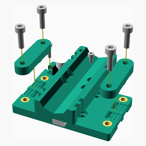

[Top](#TOP)

---

## 8 x Idler Assembly
### Vitamins
|Qty|Description|
|---:|:----------|
|16| Ball bearing F623-2RS 3mm x 10mm x 4mm|
|24| Washer  M3 x 7mm x 0.5mm|

### Assembly instructions

[Top](#TOP)

---

## Right Y Carriage Assembly
### Vitamins
|Qty|Description|
|---:|:----------|
|2| Nut M4 x 3.2mm |
|2| Screw M3 cap x 45mm|
|2| Washer  M3 x 7mm x 0.5mm|
|2| Washer  M4 x 9mm x 0.8mm|

### 3D Printed parts

| 1 x [right_lower_y_carriage.stl](stls/right_lower_y_carriage.stl) | 1 x [right_y_carriage.stl](stls/right_y_carriage.stl) |
|---|---|
|  |  

### Sub-assemblies

| 2 x idler_assembly |
|---|
|  

### Assembly instructions

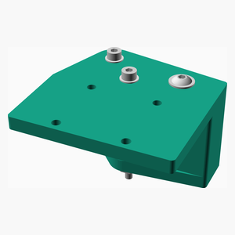

[Top](#TOP)

---

## Left Y Carriage Assembly
### Vitamins
|Qty|Description|
|---:|:----------|
|2| Nut M4 x 3.2mm |
|2| Screw M3 cap x 45mm|
|2| Washer  M3 x 7mm x 0.5mm|
|2| Washer  M4 x 9mm x 0.8mm|

### 3D Printed parts

| 1 x [left_lower_y_carriage.stl](stls/left_lower_y_carriage.stl) | 1 x [left_y_carriage.stl](stls/left_y_carriage.stl) |
|---|---|
|  |  

### Sub-assemblies

| 2 x idler_assembly |
|---|
|  

### Assembly instructions
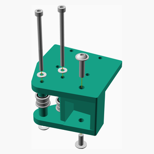

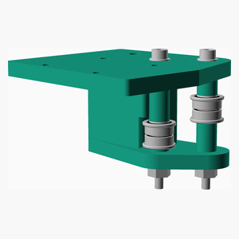

[Top](#TOP)

---

## X Rail Carriage Assembly
### Vitamins
|Qty|Description|
|---:|:----------|
|1| Extrusion E2020 x 450mm|
|1| Linear rail MGN12 x 400mm|
|1| Linear rail carriage MGN12H|
|16| Nut M3 sliding T|
|14| Screw M3 cap x 10mm|
|2| Screw M3 cs cap x 12mm|

### Assembly instructions
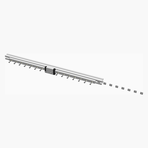

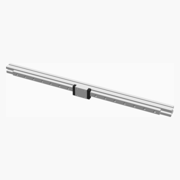

[Top](#TOP)

---

## X Rail Left Assembly
### Vitamins
|Qty|Description|
|---:|:----------|
|2| Nut M3 sliding T|
|1| Screw M4 flanged x 10mm|
|1| Screw M4 flanged x 16mm|

### Sub-assemblies

| 1 x left_y_carriage_assembly | 1 x x_rail_carriage_assembly |
|---|---|
|  |  

### Assembly instructions
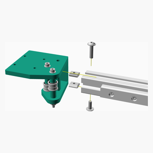

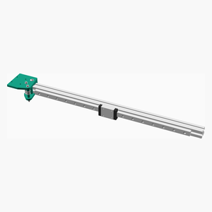

[Top](#TOP)

---

## X Rail Assembly
### Vitamins
|Qty|Description|
|---:|:----------|
|2| Nut M3 sliding T|
|1| Screw M4 flanged x 10mm|
|1| Screw M4 flanged x 16mm|

### Sub-assemblies

| 1 x right_y_carriage_assembly | 1 x x_rail_left_assembly |
|---|---|
|  |  

### Assembly instructions

[Top](#TOP)

---

## 2 x Double Idler Assembly
### Vitamins
|Qty|Description|
|---:|:----------|
|8| Ball bearing F623-2RS 3mm x 10mm x 4mm|
|14| Washer  M3 x 7mm x 0.5mm|

### Assembly instructions

[Top](#TOP)

---

## Right Motor Pulley Assembly
### Vitamins
|Qty|Description|
|---:|:----------|
|1| Pulley GT2OB 20 teeth|
|2| Screw M3 grub x  6mm|
|1| Stepper motor NEMA17 x 47mm (5x24 shaft)|

### Assembly instructions

[Top](#TOP)

---

## Right Motor Assembly
### Vitamins
|Qty|Description|
|---:|:----------|
|4| Screw M3 cap x 35mm|
|4| Washer  M3 x 7mm x 0.5mm|

### 3D Printed parts

| 1 x [right_lower_motor_mount.stl](stls/right_lower_motor_mount.stl) | 1 x [right_motor_mount.stl](stls/right_motor_mount.stl) |
|---|---|
|  |  

### Sub-assemblies

| 1 x double_idler_assembly | 1 x idler_assembly | 1 x right_motor_pulley_assembly |
|---|---|---|
|  |  |  

### Assembly instructions
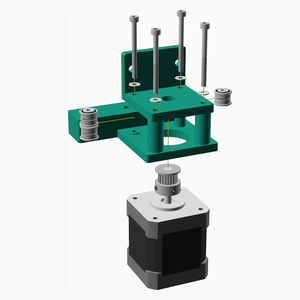

[Top](#TOP)

---

## Left Motor Pulley Assembly
### Vitamins
|Qty|Description|
|---:|:----------|
|1| Pulley GT2OB 20 teeth|
|2| Screw M3 grub x  6mm|
|1| Stepper motor NEMA17 x 47mm (5x24 shaft)|

### Assembly instructions

[Top](#TOP)

---

## Left Motor Assembly
### Vitamins
|Qty|Description|
|---:|:----------|
|4| Screw M3 cap x 35mm|
|4| Washer  M3 x 7mm x 0.5mm|

### 3D Printed parts

| 1 x [left_lower_motor_mount.stl](stls/left_lower_motor_mount.stl) | 1 x [left_motor_mount.stl](stls/left_motor_mount.stl) |
|---|---|
|  |  

### Sub-assemblies

| 1 x double_idler_assembly | 1 x idler_assembly | 1 x left_motor_pulley_assembly |
|---|---|---|
|  |  |  

### Assembly instructions

[Top](#TOP)

---

## Right Inner Idler Assembly
### Vitamins
|Qty|Description|
|---:|:----------|
|1| Screw M3 grub x 20mm|
|2| Screw M4 flanged x 45mm|

### 3D Printed parts

| 1 x [right_front_idler.stl](stls/right_front_idler.stl) |
|---|
|  

### Sub-assemblies

| 1 x idler_assembly |
|---|
|  

### Assembly instructions
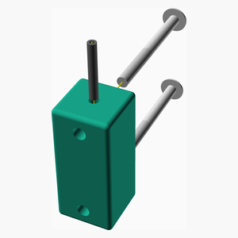

[Top](#TOP)

---

## Right Idler Assembly
### Vitamins
|Qty|Description|
|---:|:----------|
|2| Nut M4 x 3.2mm |

### 3D Printed parts

| 1 x [right_idler_mount.stl](stls/right_idler_mount.stl) |
|---|
|  

### Sub-assemblies

| 1 x right_inner_idler_assembly |
|---|
|  

### Assembly instructions
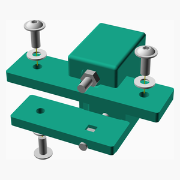

[Top](#TOP)

---

## Left Inner Idler Assembly
### Vitamins
|Qty|Description|
|---:|:----------|
|1| Screw M3 grub x 20mm|
|2| Screw M4 flanged x 45mm|

### 3D Printed parts

| 1 x [left_front_idler.stl](stls/left_front_idler.stl) |
|---|
|  

### Sub-assemblies

| 1 x idler_assembly |
|---|
|  

### Assembly instructions
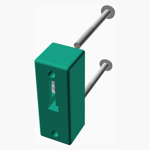

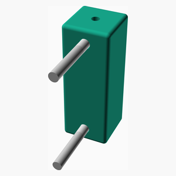

[Top](#TOP)

---

## Left Idler Assembly
### Vitamins
|Qty|Description|
|---:|:----------|
|2| Nut M4 x 3.2mm |

### 3D Printed parts

| 1 x [left_idler_mount.stl](stls/left_idler_mount.stl) |
|---|
| 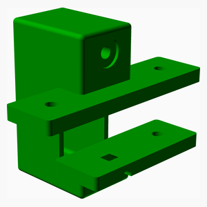 

### Sub-assemblies

| 1 x left_inner_idler_assembly |
|---|
|  

### Assembly instructions
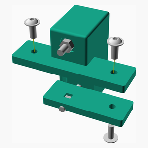

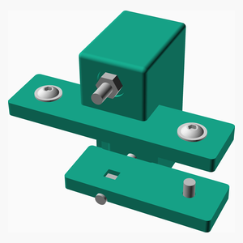

[Top](#TOP)

---

## Front Frame Left Assembly
### Vitamins
|Qty|Description|
|---:|:----------|
|1| Extrusion E2040 x 472mm|
|4| Nut M4 sliding T|
|1| Screw M4 flanged x 10mm|
|1| Screw M5 low profile x 10mm|

### 3D Printed parts

| 1 x [left_front_corner.stl](stls/left_front_corner.stl) |
|---|
| 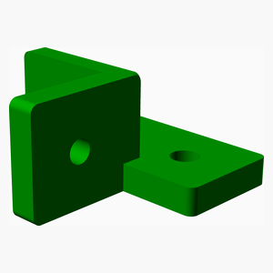 

### Assembly instructions
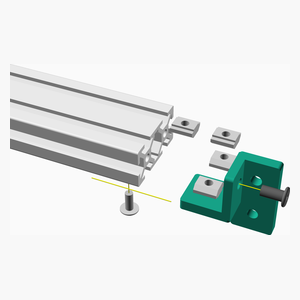

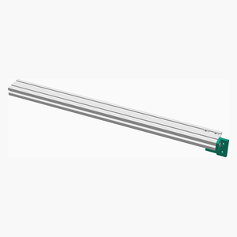

[Top](#TOP)

---

## Front Frame Assembly
### Vitamins
|Qty|Description|
|---:|:----------|
|4| Nut M4 sliding T|
|1| Screw M4 flanged x 10mm|
|1| Screw M5 low profile x 10mm|

### 3D Printed parts

| 1 x [right_front_corner.stl](stls/right_front_corner.stl) |
|---|
| 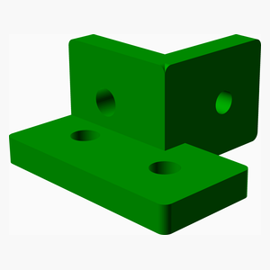 

### Sub-assemblies

| 1 x front_frame_left_assembly |
|---|
|  

### Assembly instructions

[Top](#TOP)

---

## Back Frame Left Assembly
### Vitamins
|Qty|Description|
|---:|:----------|
|1| Extrusion E2040 x 472mm|
|7| Nut M4 sliding T|
|3| Screw M4 flanged x 10mm|

### 3D Printed parts

| 1 x [left_back_corner.stl](stls/left_back_corner.stl) |
|---|
| 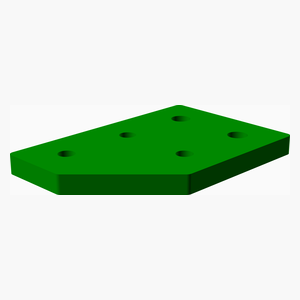 

### Assembly instructions
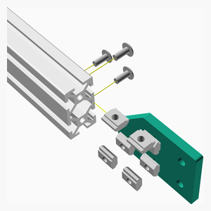

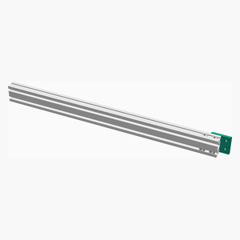

[Top](#TOP)

---

## Back Frame Assembly
### Vitamins
|Qty|Description|
|---:|:----------|
|7| Nut M4 sliding T|
|3| Screw M4 flanged x 10mm|

### 3D Printed parts

| 1 x [right_back_corner.stl](stls/right_back_corner.stl) |
|---|
| 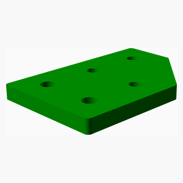 

### Sub-assemblies

| 1 x back_frame_left_assembly |
|---|
|  

### Assembly instructions
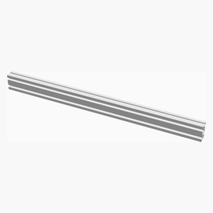

[Top](#TOP)

---

## 2 x Y Rail Assembly
### Vitamins
|Qty|Description|
|---:|:----------|
|2| Extrusion E2040 x 354mm|
|2| Linear rail MGN15 x 300mm|
|2| Linear rail carriage MGN15H|
|16| Nut M3 sliding T|
|12| Screw M3 cap x 10mm|
|4| Screw M3 cs cap x 12mm|

### Assembly instructions

[Top](#TOP)

---

## Back And Y Assembly
### Vitamins
|Qty|Description|
|---:|:----------|
|2| Nut M4 sliding T|
|4| Screw M5 flanged x 10mm|

### Sub-assemblies

| 1 x back_frame_assembly | 2 x y_rail_assembly |
|---|---|
|  |  

### Assembly instructions
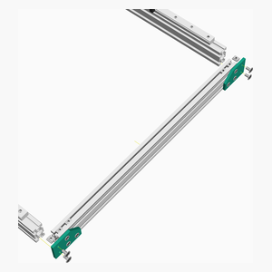

Repeat for both back corners

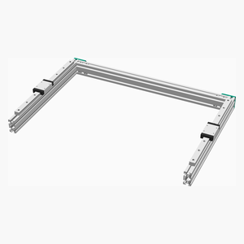

[Top](#TOP)

---

## Frame Assembly
### Vitamins
|Qty|Description|
|---:|:----------|
|2| Nut M4 sliding T|
|2| Screw M5 flanged x 10mm|
|2| Screw M5 low profile x 10mm|

### Sub-assemblies

| 1 x back_and_y_assembly | 1 x front_frame_assembly |
|---|---|
|  |  

### Assembly instructions

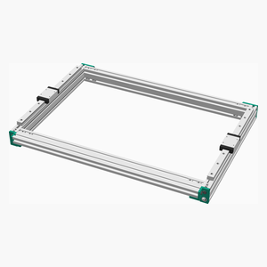

[Top](#TOP)

---

## Frame Idler Assembly
### Vitamins
|Qty|Description|
|---:|:----------|
|6| Screw M4 flanged x 10mm|

### Sub-assemblies

| 1 x frame_assembly | 1 x left_idler_assembly | 1 x right_idler_assembly |
|---|---|---|
|  |  |  

### Assembly instructions

Repeat at both front idler mounts

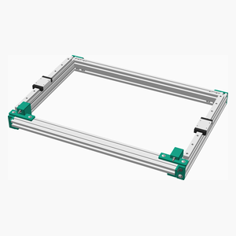

[Top](#TOP)

---

## Frame Motor Assembly
### Vitamins
|Qty|Description|
|---:|:----------|
|10| Screw M4 flanged x 10mm|

### Sub-assemblies

| 1 x frame_idler_assembly | 1 x left_motor_assembly | 1 x right_motor_assembly |
|---|---|---|
|  |  |  

### Assembly instructions

Repeat at both motor mounts

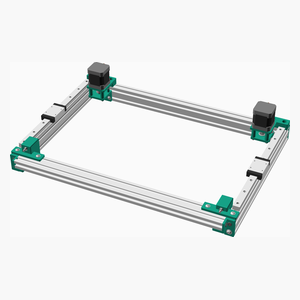

[Top](#TOP)

---

## Frame X Rail Assembly
### Vitamins
|Qty|Description|
|---:|:----------|
|8| Screw M3 cap x 10mm|
|8| Washer  M3 x 7mm x 0.5mm|

### Sub-assemblies

| 1 x frame_motor_assembly | 1 x x_rail_assembly |
|---|---|
|  |  

### Assembly instructions
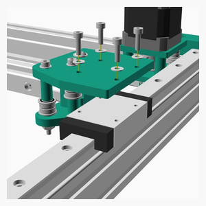

Repeat at both y carriages

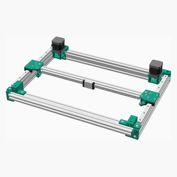

[Top](#TOP)

---

## Frame X Carriage Assembly
### Vitamins
|Qty|Description|
|---:|:----------|
|4| Screw M3 cap x 10mm|
|4| Washer  M3 x 7mm x 0.5mm|

### Sub-assemblies

| 1 x frame_x_rail_assembly | 1 x x_carriage_assembly |
|---|---|
|  |  

### Assembly instructions
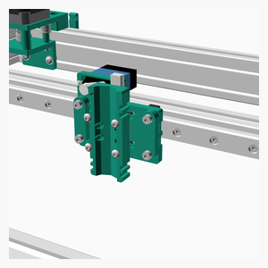

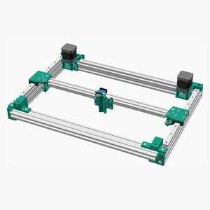

[Top](#TOP)

---

## Main Assembly
### Vitamins
|Qty|Description|
|---:|:----------|
|1| Belt GT2 x 6mm x 1524mm|
|1| Belt GT2 x 6mm x 1524mm|

### Sub-assemblies

| 1 x frame_x_carriage_assembly |
|---|
|  

### Assembly instructions

Put the belts in with front idlers as loose then
tighten the clamps. Finally, tighten the idlers
evenly.

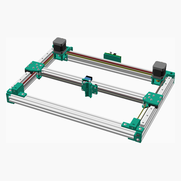

[Top](#TOP)
