
# M-draw-scad
Drawing bot with MGN rails

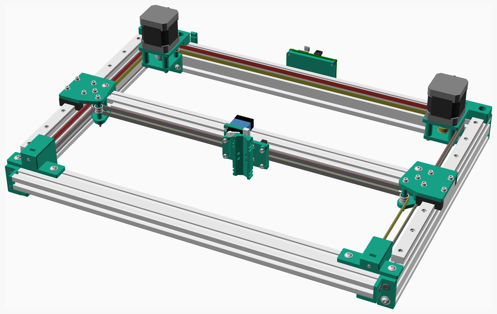

---
## Table of Contents
1. [Parts list](#Parts_list)
1. [Idler Assembly](#idler_assembly)
1. [Right Inner Idler Assembly](#right_inner_idler_assembly)
1. [Right Idler Assembly](#right_idler_assembly)
1. [Double Idler Assembly](#double_idler_assembly)
1. [Right Motor Assembly](#right_motor_assembly)
1. [Left Motor Assembly](#left_motor_assembly)
1. [X Carriage Insert Assembly](#x_carriage_insert_assembly)
1. [X Carriage Assembly](#x_carriage_assembly)
1. [X Rail Assembly](#x_rail_assembly)
1. [Back Frame Assembly](#back_frame_assembly)
1. [Front Frame Assembly](#front_frame_assembly)
1. [Right Y Carriage Assembly](#right_y_carriage_assembly)
1. [Y Rail Assembly](#y_rail_assembly)
1. [Right Y Rail Assembly](#right_y_rail_assembly)
1. [Left Y Carriage Assembly](#left_y_carriage_assembly)
1. [Left Y Rail Assembly](#left_y_rail_assembly)
1. [Main Assembly](#main_assembly)

[Top](#TOP)

---

## Parts list
| 7 x Idler | Right&nbsp;Inner&nbsp;Idler | Right&nbsp;Idler | 2 x Double&nbsp;Idler | Right&nbsp;Motor | Left&nbsp;Motor | X&nbsp;Carriage&nbsp;Insert | X&nbsp;Carriage | X&nbsp;Rail | Back&nbsp;Frame | Front&nbsp;Frame | Right&nbsp;Y&nbsp;Carriage | 2 x Y&nbsp;Rail | Right&nbsp;Y&nbsp;Rail | Left&nbsp;Y&nbsp;Carriage | Left&nbsp;Y&nbsp;Rail | Main | TOTALS |  |
|---:|---:|---:|---:|---:|---:|---:|---:|---:|---:|---:|---:|---:|---:|---:|---:|---:|---:|:---|
|  |  |  |  |  |  |  |  |  |  |  |  |  |  |  |  |  | | **Vitamins** |
| &nbsp;&nbsp;14&nbsp; | &nbsp;&nbsp;.&nbsp; | &nbsp;&nbsp;.&nbsp; | &nbsp;&nbsp;8&nbsp; | &nbsp;&nbsp;.&nbsp; | &nbsp;&nbsp;.&nbsp; | &nbsp;&nbsp;.&nbsp; | &nbsp;&nbsp;.&nbsp; | &nbsp;&nbsp;.&nbsp; | &nbsp;&nbsp;.&nbsp; | &nbsp;&nbsp;.&nbsp; | &nbsp;&nbsp;.&nbsp; | &nbsp;&nbsp;.&nbsp; | &nbsp;&nbsp;.&nbsp; | &nbsp;&nbsp;.&nbsp; | &nbsp;&nbsp;.&nbsp; | &nbsp;&nbsp;.&nbsp; |  &nbsp;&nbsp;22&nbsp; | &nbsp;&nbsp; Ball bearing F623-2RS 3mm x 10mm x 4mm |
| &nbsp;&nbsp;.&nbsp; | &nbsp;&nbsp;.&nbsp; | &nbsp;&nbsp;.&nbsp; | &nbsp;&nbsp;.&nbsp; | &nbsp;&nbsp;.&nbsp; | &nbsp;&nbsp;.&nbsp; | &nbsp;&nbsp;.&nbsp; | &nbsp;&nbsp;.&nbsp; | &nbsp;&nbsp;.&nbsp; | &nbsp;&nbsp;.&nbsp; | &nbsp;&nbsp;.&nbsp; | &nbsp;&nbsp;.&nbsp; | &nbsp;&nbsp;.&nbsp; | &nbsp;&nbsp;.&nbsp; | &nbsp;&nbsp;.&nbsp; | &nbsp;&nbsp;.&nbsp; | &nbsp;&nbsp;1&nbsp; |  &nbsp;&nbsp;1&nbsp; | &nbsp;&nbsp; Belt GT2 x 6mm x 1522mm |
| &nbsp;&nbsp;.&nbsp; | &nbsp;&nbsp;.&nbsp; | &nbsp;&nbsp;.&nbsp; | &nbsp;&nbsp;.&nbsp; | &nbsp;&nbsp;.&nbsp; | &nbsp;&nbsp;.&nbsp; | &nbsp;&nbsp;.&nbsp; | &nbsp;&nbsp;.&nbsp; | &nbsp;&nbsp;.&nbsp; | &nbsp;&nbsp;.&nbsp; | &nbsp;&nbsp;.&nbsp; | &nbsp;&nbsp;.&nbsp; | &nbsp;&nbsp;.&nbsp; | &nbsp;&nbsp;.&nbsp; | &nbsp;&nbsp;.&nbsp; | &nbsp;&nbsp;.&nbsp; | &nbsp;&nbsp;1&nbsp; |  &nbsp;&nbsp;1&nbsp; | &nbsp;&nbsp; Belt GT2 x 6mm x 1522mm |
| &nbsp;&nbsp;.&nbsp; | &nbsp;&nbsp;.&nbsp; | &nbsp;&nbsp;.&nbsp; | &nbsp;&nbsp;.&nbsp; | &nbsp;&nbsp;.&nbsp; | &nbsp;&nbsp;.&nbsp; | &nbsp;&nbsp;.&nbsp; | &nbsp;&nbsp;.&nbsp; | &nbsp;&nbsp;1&nbsp; | &nbsp;&nbsp;.&nbsp; | &nbsp;&nbsp;.&nbsp; | &nbsp;&nbsp;.&nbsp; | &nbsp;&nbsp;.&nbsp; | &nbsp;&nbsp;.&nbsp; | &nbsp;&nbsp;.&nbsp; | &nbsp;&nbsp;.&nbsp; | &nbsp;&nbsp;.&nbsp; |  &nbsp;&nbsp;1&nbsp; | &nbsp;&nbsp; Extrusion E2020 x 450mm |
| &nbsp;&nbsp;.&nbsp; | &nbsp;&nbsp;.&nbsp; | &nbsp;&nbsp;.&nbsp; | &nbsp;&nbsp;.&nbsp; | &nbsp;&nbsp;.&nbsp; | &nbsp;&nbsp;.&nbsp; | &nbsp;&nbsp;.&nbsp; | &nbsp;&nbsp;.&nbsp; | &nbsp;&nbsp;.&nbsp; | &nbsp;&nbsp;.&nbsp; | &nbsp;&nbsp;.&nbsp; | &nbsp;&nbsp;.&nbsp; | &nbsp;&nbsp;2&nbsp; | &nbsp;&nbsp;.&nbsp; | &nbsp;&nbsp;.&nbsp; | &nbsp;&nbsp;.&nbsp; | &nbsp;&nbsp;.&nbsp; |  &nbsp;&nbsp;2&nbsp; | &nbsp;&nbsp; Extrusion E2040 x 354mm |
| &nbsp;&nbsp;.&nbsp; | &nbsp;&nbsp;.&nbsp; | &nbsp;&nbsp;.&nbsp; | &nbsp;&nbsp;.&nbsp; | &nbsp;&nbsp;.&nbsp; | &nbsp;&nbsp;.&nbsp; | &nbsp;&nbsp;.&nbsp; | &nbsp;&nbsp;.&nbsp; | &nbsp;&nbsp;.&nbsp; | &nbsp;&nbsp;1&nbsp; | &nbsp;&nbsp;1&nbsp; | &nbsp;&nbsp;.&nbsp; | &nbsp;&nbsp;.&nbsp; | &nbsp;&nbsp;.&nbsp; | &nbsp;&nbsp;.&nbsp; | &nbsp;&nbsp;.&nbsp; | &nbsp;&nbsp;.&nbsp; |  &nbsp;&nbsp;2&nbsp; | &nbsp;&nbsp; Extrusion E2040 x 472mm |
| &nbsp;&nbsp;.&nbsp; | &nbsp;&nbsp;.&nbsp; | &nbsp;&nbsp;.&nbsp; | &nbsp;&nbsp;.&nbsp; | &nbsp;&nbsp;.&nbsp; | &nbsp;&nbsp;.&nbsp; | &nbsp;&nbsp;4&nbsp; | &nbsp;&nbsp;.&nbsp; | &nbsp;&nbsp;.&nbsp; | &nbsp;&nbsp;.&nbsp; | &nbsp;&nbsp;.&nbsp; | &nbsp;&nbsp;.&nbsp; | &nbsp;&nbsp;.&nbsp; | &nbsp;&nbsp;.&nbsp; | &nbsp;&nbsp;.&nbsp; | &nbsp;&nbsp;.&nbsp; | &nbsp;&nbsp;.&nbsp; |  &nbsp;&nbsp;4&nbsp; | &nbsp;&nbsp; Heatfit insert M3 x 4mm |
| &nbsp;&nbsp;.&nbsp; | &nbsp;&nbsp;.&nbsp; | &nbsp;&nbsp;.&nbsp; | &nbsp;&nbsp;.&nbsp; | &nbsp;&nbsp;.&nbsp; | &nbsp;&nbsp;.&nbsp; | &nbsp;&nbsp;.&nbsp; | &nbsp;&nbsp;.&nbsp; | &nbsp;&nbsp;1&nbsp; | &nbsp;&nbsp;.&nbsp; | &nbsp;&nbsp;.&nbsp; | &nbsp;&nbsp;.&nbsp; | &nbsp;&nbsp;.&nbsp; | &nbsp;&nbsp;.&nbsp; | &nbsp;&nbsp;.&nbsp; | &nbsp;&nbsp;.&nbsp; | &nbsp;&nbsp;.&nbsp; |  &nbsp;&nbsp;1&nbsp; | &nbsp;&nbsp; Linear rail MGN12 x 400mm |
| &nbsp;&nbsp;.&nbsp; | &nbsp;&nbsp;.&nbsp; | &nbsp;&nbsp;.&nbsp; | &nbsp;&nbsp;.&nbsp; | &nbsp;&nbsp;.&nbsp; | &nbsp;&nbsp;.&nbsp; | &nbsp;&nbsp;.&nbsp; | &nbsp;&nbsp;.&nbsp; | &nbsp;&nbsp;.&nbsp; | &nbsp;&nbsp;.&nbsp; | &nbsp;&nbsp;.&nbsp; | &nbsp;&nbsp;.&nbsp; | &nbsp;&nbsp;2&nbsp; | &nbsp;&nbsp;.&nbsp; | &nbsp;&nbsp;.&nbsp; | &nbsp;&nbsp;.&nbsp; | &nbsp;&nbsp;.&nbsp; |  &nbsp;&nbsp;2&nbsp; | &nbsp;&nbsp; Linear rail MGN15 x 300mm |
| &nbsp;&nbsp;.&nbsp; | &nbsp;&nbsp;.&nbsp; | &nbsp;&nbsp;.&nbsp; | &nbsp;&nbsp;.&nbsp; | &nbsp;&nbsp;.&nbsp; | &nbsp;&nbsp;.&nbsp; | &nbsp;&nbsp;.&nbsp; | &nbsp;&nbsp;.&nbsp; | &nbsp;&nbsp;1&nbsp; | &nbsp;&nbsp;.&nbsp; | &nbsp;&nbsp;.&nbsp; | &nbsp;&nbsp;.&nbsp; | &nbsp;&nbsp;.&nbsp; | &nbsp;&nbsp;.&nbsp; | &nbsp;&nbsp;.&nbsp; | &nbsp;&nbsp;.&nbsp; | &nbsp;&nbsp;.&nbsp; |  &nbsp;&nbsp;1&nbsp; | &nbsp;&nbsp; Linear rail carriage MGN12H |
| &nbsp;&nbsp;.&nbsp; | &nbsp;&nbsp;.&nbsp; | &nbsp;&nbsp;.&nbsp; | &nbsp;&nbsp;.&nbsp; | &nbsp;&nbsp;.&nbsp; | &nbsp;&nbsp;.&nbsp; | &nbsp;&nbsp;.&nbsp; | &nbsp;&nbsp;.&nbsp; | &nbsp;&nbsp;.&nbsp; | &nbsp;&nbsp;.&nbsp; | &nbsp;&nbsp;.&nbsp; | &nbsp;&nbsp;.&nbsp; | &nbsp;&nbsp;2&nbsp; | &nbsp;&nbsp;.&nbsp; | &nbsp;&nbsp;.&nbsp; | &nbsp;&nbsp;.&nbsp; | &nbsp;&nbsp;.&nbsp; |  &nbsp;&nbsp;2&nbsp; | &nbsp;&nbsp; Linear rail carriage MGN15H |
| &nbsp;&nbsp;.&nbsp; | &nbsp;&nbsp;.&nbsp; | &nbsp;&nbsp;2&nbsp; | &nbsp;&nbsp;.&nbsp; | &nbsp;&nbsp;.&nbsp; | &nbsp;&nbsp;.&nbsp; | &nbsp;&nbsp;.&nbsp; | &nbsp;&nbsp;.&nbsp; | &nbsp;&nbsp;.&nbsp; | &nbsp;&nbsp;.&nbsp; | &nbsp;&nbsp;.&nbsp; | &nbsp;&nbsp;.&nbsp; | &nbsp;&nbsp;.&nbsp; | &nbsp;&nbsp;.&nbsp; | &nbsp;&nbsp;.&nbsp; | &nbsp;&nbsp;.&nbsp; | &nbsp;&nbsp;.&nbsp; |  &nbsp;&nbsp;2&nbsp; | &nbsp;&nbsp; Nut M4 x 3.2mm  |
| &nbsp;&nbsp;.&nbsp; | &nbsp;&nbsp;.&nbsp; | &nbsp;&nbsp;.&nbsp; | &nbsp;&nbsp;.&nbsp; | &nbsp;&nbsp;.&nbsp; | &nbsp;&nbsp;.&nbsp; | &nbsp;&nbsp;.&nbsp; | &nbsp;&nbsp;.&nbsp; | &nbsp;&nbsp;.&nbsp; | &nbsp;&nbsp;.&nbsp; | &nbsp;&nbsp;.&nbsp; | &nbsp;&nbsp;2&nbsp; | &nbsp;&nbsp;.&nbsp; | &nbsp;&nbsp;.&nbsp; | &nbsp;&nbsp;2&nbsp; | &nbsp;&nbsp;.&nbsp; | &nbsp;&nbsp;.&nbsp; |  &nbsp;&nbsp;4&nbsp; | &nbsp;&nbsp; Nut M4 x 3.2mm  |
| &nbsp;&nbsp;.&nbsp; | &nbsp;&nbsp;.&nbsp; | &nbsp;&nbsp;.&nbsp; | &nbsp;&nbsp;.&nbsp; | &nbsp;&nbsp;1&nbsp; | &nbsp;&nbsp;1&nbsp; | &nbsp;&nbsp;.&nbsp; | &nbsp;&nbsp;.&nbsp; | &nbsp;&nbsp;.&nbsp; | &nbsp;&nbsp;.&nbsp; | &nbsp;&nbsp;.&nbsp; | &nbsp;&nbsp;.&nbsp; | &nbsp;&nbsp;.&nbsp; | &nbsp;&nbsp;.&nbsp; | &nbsp;&nbsp;.&nbsp; | &nbsp;&nbsp;.&nbsp; | &nbsp;&nbsp;.&nbsp; |  &nbsp;&nbsp;2&nbsp; | &nbsp;&nbsp; Pulley GT2OB 20 teeth |
| &nbsp;&nbsp;.&nbsp; | &nbsp;&nbsp;.&nbsp; | &nbsp;&nbsp;.&nbsp; | &nbsp;&nbsp;.&nbsp; | &nbsp;&nbsp;.&nbsp; | &nbsp;&nbsp;.&nbsp; | &nbsp;&nbsp;.&nbsp; | &nbsp;&nbsp;4&nbsp; | &nbsp;&nbsp;.&nbsp; | &nbsp;&nbsp;.&nbsp; | &nbsp;&nbsp;.&nbsp; | &nbsp;&nbsp;.&nbsp; | &nbsp;&nbsp;.&nbsp; | &nbsp;&nbsp;4&nbsp; | &nbsp;&nbsp;.&nbsp; | &nbsp;&nbsp;4&nbsp; | &nbsp;&nbsp;.&nbsp; |  &nbsp;&nbsp;12&nbsp; | &nbsp;&nbsp; Screw M3 cap x 10mm |
| &nbsp;&nbsp;.&nbsp; | &nbsp;&nbsp;1&nbsp; | &nbsp;&nbsp;.&nbsp; | &nbsp;&nbsp;.&nbsp; | &nbsp;&nbsp;.&nbsp; | &nbsp;&nbsp;.&nbsp; | &nbsp;&nbsp;.&nbsp; | &nbsp;&nbsp;.&nbsp; | &nbsp;&nbsp;.&nbsp; | &nbsp;&nbsp;.&nbsp; | &nbsp;&nbsp;.&nbsp; | &nbsp;&nbsp;.&nbsp; | &nbsp;&nbsp;.&nbsp; | &nbsp;&nbsp;.&nbsp; | &nbsp;&nbsp;.&nbsp; | &nbsp;&nbsp;.&nbsp; | &nbsp;&nbsp;.&nbsp; |  &nbsp;&nbsp;1&nbsp; | &nbsp;&nbsp; Screw M3 cap x 16mm |
| &nbsp;&nbsp;.&nbsp; | &nbsp;&nbsp;.&nbsp; | &nbsp;&nbsp;.&nbsp; | &nbsp;&nbsp;.&nbsp; | &nbsp;&nbsp;4&nbsp; | &nbsp;&nbsp;4&nbsp; | &nbsp;&nbsp;.&nbsp; | &nbsp;&nbsp;.&nbsp; | &nbsp;&nbsp;.&nbsp; | &nbsp;&nbsp;.&nbsp; | &nbsp;&nbsp;.&nbsp; | &nbsp;&nbsp;.&nbsp; | &nbsp;&nbsp;.&nbsp; | &nbsp;&nbsp;.&nbsp; | &nbsp;&nbsp;.&nbsp; | &nbsp;&nbsp;.&nbsp; | &nbsp;&nbsp;.&nbsp; |  &nbsp;&nbsp;8&nbsp; | &nbsp;&nbsp; Screw M3 cap x 35mm |
| &nbsp;&nbsp;.&nbsp; | &nbsp;&nbsp;.&nbsp; | &nbsp;&nbsp;.&nbsp; | &nbsp;&nbsp;.&nbsp; | &nbsp;&nbsp;.&nbsp; | &nbsp;&nbsp;.&nbsp; | &nbsp;&nbsp;.&nbsp; | &nbsp;&nbsp;.&nbsp; | &nbsp;&nbsp;.&nbsp; | &nbsp;&nbsp;.&nbsp; | &nbsp;&nbsp;.&nbsp; | &nbsp;&nbsp;2&nbsp; | &nbsp;&nbsp;.&nbsp; | &nbsp;&nbsp;.&nbsp; | &nbsp;&nbsp;2&nbsp; | &nbsp;&nbsp;.&nbsp; | &nbsp;&nbsp;.&nbsp; |  &nbsp;&nbsp;4&nbsp; | &nbsp;&nbsp; Screw M3 cap x 45mm |
| &nbsp;&nbsp;.&nbsp; | &nbsp;&nbsp;.&nbsp; | &nbsp;&nbsp;3&nbsp; | &nbsp;&nbsp;.&nbsp; | &nbsp;&nbsp;5&nbsp; | &nbsp;&nbsp;5&nbsp; | &nbsp;&nbsp;.&nbsp; | &nbsp;&nbsp;.&nbsp; | &nbsp;&nbsp;.&nbsp; | &nbsp;&nbsp;.&nbsp; | &nbsp;&nbsp;.&nbsp; | &nbsp;&nbsp;1&nbsp; | &nbsp;&nbsp;.&nbsp; | &nbsp;&nbsp;.&nbsp; | &nbsp;&nbsp;1&nbsp; | &nbsp;&nbsp;.&nbsp; | &nbsp;&nbsp;.&nbsp; |  &nbsp;&nbsp;15&nbsp; | &nbsp;&nbsp; Screw M4 flanged x 10mm |
| &nbsp;&nbsp;.&nbsp; | &nbsp;&nbsp;.&nbsp; | &nbsp;&nbsp;.&nbsp; | &nbsp;&nbsp;.&nbsp; | &nbsp;&nbsp;.&nbsp; | &nbsp;&nbsp;.&nbsp; | &nbsp;&nbsp;.&nbsp; | &nbsp;&nbsp;.&nbsp; | &nbsp;&nbsp;.&nbsp; | &nbsp;&nbsp;.&nbsp; | &nbsp;&nbsp;.&nbsp; | &nbsp;&nbsp;1&nbsp; | &nbsp;&nbsp;.&nbsp; | &nbsp;&nbsp;.&nbsp; | &nbsp;&nbsp;1&nbsp; | &nbsp;&nbsp;.&nbsp; | &nbsp;&nbsp;.&nbsp; |  &nbsp;&nbsp;2&nbsp; | &nbsp;&nbsp; Screw M4 flanged x 16mm |
| &nbsp;&nbsp;.&nbsp; | &nbsp;&nbsp;2&nbsp; | &nbsp;&nbsp;.&nbsp; | &nbsp;&nbsp;.&nbsp; | &nbsp;&nbsp;.&nbsp; | &nbsp;&nbsp;.&nbsp; | &nbsp;&nbsp;.&nbsp; | &nbsp;&nbsp;.&nbsp; | &nbsp;&nbsp;.&nbsp; | &nbsp;&nbsp;.&nbsp; | &nbsp;&nbsp;.&nbsp; | &nbsp;&nbsp;.&nbsp; | &nbsp;&nbsp;.&nbsp; | &nbsp;&nbsp;.&nbsp; | &nbsp;&nbsp;.&nbsp; | &nbsp;&nbsp;.&nbsp; | &nbsp;&nbsp;.&nbsp; |  &nbsp;&nbsp;2&nbsp; | &nbsp;&nbsp; Screw M4 flanged x 45mm |
| &nbsp;&nbsp;.&nbsp; | &nbsp;&nbsp;.&nbsp; | &nbsp;&nbsp;.&nbsp; | &nbsp;&nbsp;.&nbsp; | &nbsp;&nbsp;1&nbsp; | &nbsp;&nbsp;1&nbsp; | &nbsp;&nbsp;.&nbsp; | &nbsp;&nbsp;.&nbsp; | &nbsp;&nbsp;.&nbsp; | &nbsp;&nbsp;.&nbsp; | &nbsp;&nbsp;.&nbsp; | &nbsp;&nbsp;.&nbsp; | &nbsp;&nbsp;.&nbsp; | &nbsp;&nbsp;.&nbsp; | &nbsp;&nbsp;.&nbsp; | &nbsp;&nbsp;.&nbsp; | &nbsp;&nbsp;.&nbsp; |  &nbsp;&nbsp;2&nbsp; | &nbsp;&nbsp; Stepper motor NEMA17 x 47mm (5x24 shaft) |
| &nbsp;&nbsp;21&nbsp; | &nbsp;&nbsp;.&nbsp; | &nbsp;&nbsp;.&nbsp; | &nbsp;&nbsp;14&nbsp; | &nbsp;&nbsp;4&nbsp; | &nbsp;&nbsp;4&nbsp; | &nbsp;&nbsp;.&nbsp; | &nbsp;&nbsp;.&nbsp; | &nbsp;&nbsp;.&nbsp; | &nbsp;&nbsp;.&nbsp; | &nbsp;&nbsp;.&nbsp; | &nbsp;&nbsp;2&nbsp; | &nbsp;&nbsp;.&nbsp; | &nbsp;&nbsp;4&nbsp; | &nbsp;&nbsp;2&nbsp; | &nbsp;&nbsp;4&nbsp; | &nbsp;&nbsp;.&nbsp; |  &nbsp;&nbsp;55&nbsp; | &nbsp;&nbsp; Washer  M3 x 7mm x 0.5mm |
| &nbsp;&nbsp;.&nbsp; | &nbsp;&nbsp;.&nbsp; | &nbsp;&nbsp;3&nbsp; | &nbsp;&nbsp;.&nbsp; | &nbsp;&nbsp;5&nbsp; | &nbsp;&nbsp;5&nbsp; | &nbsp;&nbsp;.&nbsp; | &nbsp;&nbsp;.&nbsp; | &nbsp;&nbsp;.&nbsp; | &nbsp;&nbsp;.&nbsp; | &nbsp;&nbsp;.&nbsp; | &nbsp;&nbsp;2&nbsp; | &nbsp;&nbsp;.&nbsp; | &nbsp;&nbsp;.&nbsp; | &nbsp;&nbsp;2&nbsp; | &nbsp;&nbsp;.&nbsp; | &nbsp;&nbsp;.&nbsp; |  &nbsp;&nbsp;17&nbsp; | &nbsp;&nbsp; Washer  M4 x 9mm x 0.8mm |
| &nbsp;&nbsp;35&nbsp; | &nbsp;&nbsp;3&nbsp; | &nbsp;&nbsp;8&nbsp; | &nbsp;&nbsp;22&nbsp; | &nbsp;&nbsp;20&nbsp; | &nbsp;&nbsp;20&nbsp; | &nbsp;&nbsp;4&nbsp; | &nbsp;&nbsp;4&nbsp; | &nbsp;&nbsp;3&nbsp; | &nbsp;&nbsp;1&nbsp; | &nbsp;&nbsp;1&nbsp; | &nbsp;&nbsp;10&nbsp; | &nbsp;&nbsp;6&nbsp; | &nbsp;&nbsp;8&nbsp; | &nbsp;&nbsp;10&nbsp; | &nbsp;&nbsp;8&nbsp; | &nbsp;&nbsp;2&nbsp; | &nbsp;&nbsp;165&nbsp; | &nbsp;&nbsp;Total vitamins count |
|  |  |  |  |  |  |  |  |  |  |  |  |  |  |  |  |  | | **3D printed parts** |
| &nbsp;&nbsp;.&nbsp; | &nbsp;&nbsp;1&nbsp; | &nbsp;&nbsp;.&nbsp; | &nbsp;&nbsp;.&nbsp; | &nbsp;&nbsp;.&nbsp; | &nbsp;&nbsp;.&nbsp; | &nbsp;&nbsp;.&nbsp; | &nbsp;&nbsp;.&nbsp; | &nbsp;&nbsp;.&nbsp; | &nbsp;&nbsp;.&nbsp; | &nbsp;&nbsp;.&nbsp; | &nbsp;&nbsp;.&nbsp; | &nbsp;&nbsp;.&nbsp; | &nbsp;&nbsp;.&nbsp; | &nbsp;&nbsp;.&nbsp; | &nbsp;&nbsp;.&nbsp; | &nbsp;&nbsp;.&nbsp; |  &nbsp;&nbsp;1&nbsp; | &nbsp;&nbsp;front_idler.stl |
| &nbsp;&nbsp;.&nbsp; | &nbsp;&nbsp;.&nbsp; | &nbsp;&nbsp;.&nbsp; | &nbsp;&nbsp;.&nbsp; | &nbsp;&nbsp;.&nbsp; | &nbsp;&nbsp;1&nbsp; | &nbsp;&nbsp;.&nbsp; | &nbsp;&nbsp;.&nbsp; | &nbsp;&nbsp;.&nbsp; | &nbsp;&nbsp;.&nbsp; | &nbsp;&nbsp;.&nbsp; | &nbsp;&nbsp;.&nbsp; | &nbsp;&nbsp;.&nbsp; | &nbsp;&nbsp;.&nbsp; | &nbsp;&nbsp;.&nbsp; | &nbsp;&nbsp;.&nbsp; | &nbsp;&nbsp;.&nbsp; |  &nbsp;&nbsp;1&nbsp; | &nbsp;&nbsp;left_lower_motor_mount.stl |
| &nbsp;&nbsp;.&nbsp; | &nbsp;&nbsp;.&nbsp; | &nbsp;&nbsp;.&nbsp; | &nbsp;&nbsp;.&nbsp; | &nbsp;&nbsp;.&nbsp; | &nbsp;&nbsp;.&nbsp; | &nbsp;&nbsp;.&nbsp; | &nbsp;&nbsp;.&nbsp; | &nbsp;&nbsp;.&nbsp; | &nbsp;&nbsp;.&nbsp; | &nbsp;&nbsp;.&nbsp; | &nbsp;&nbsp;.&nbsp; | &nbsp;&nbsp;.&nbsp; | &nbsp;&nbsp;.&nbsp; | &nbsp;&nbsp;1&nbsp; | &nbsp;&nbsp;.&nbsp; | &nbsp;&nbsp;.&nbsp; |  &nbsp;&nbsp;1&nbsp; | &nbsp;&nbsp;left_lower_y_carriage.stl |
| &nbsp;&nbsp;.&nbsp; | &nbsp;&nbsp;.&nbsp; | &nbsp;&nbsp;.&nbsp; | &nbsp;&nbsp;.&nbsp; | &nbsp;&nbsp;.&nbsp; | &nbsp;&nbsp;1&nbsp; | &nbsp;&nbsp;.&nbsp; | &nbsp;&nbsp;.&nbsp; | &nbsp;&nbsp;.&nbsp; | &nbsp;&nbsp;.&nbsp; | &nbsp;&nbsp;.&nbsp; | &nbsp;&nbsp;.&nbsp; | &nbsp;&nbsp;.&nbsp; | &nbsp;&nbsp;.&nbsp; | &nbsp;&nbsp;.&nbsp; | &nbsp;&nbsp;.&nbsp; | &nbsp;&nbsp;.&nbsp; |  &nbsp;&nbsp;1&nbsp; | &nbsp;&nbsp;left_motor_mount.stl |
| &nbsp;&nbsp;.&nbsp; | &nbsp;&nbsp;.&nbsp; | &nbsp;&nbsp;.&nbsp; | &nbsp;&nbsp;.&nbsp; | &nbsp;&nbsp;.&nbsp; | &nbsp;&nbsp;.&nbsp; | &nbsp;&nbsp;.&nbsp; | &nbsp;&nbsp;.&nbsp; | &nbsp;&nbsp;.&nbsp; | &nbsp;&nbsp;.&nbsp; | &nbsp;&nbsp;.&nbsp; | &nbsp;&nbsp;.&nbsp; | &nbsp;&nbsp;.&nbsp; | &nbsp;&nbsp;.&nbsp; | &nbsp;&nbsp;1&nbsp; | &nbsp;&nbsp;.&nbsp; | &nbsp;&nbsp;.&nbsp; |  &nbsp;&nbsp;1&nbsp; | &nbsp;&nbsp;left_y_carriage.stl |
| &nbsp;&nbsp;.&nbsp; | &nbsp;&nbsp;.&nbsp; | &nbsp;&nbsp;1&nbsp; | &nbsp;&nbsp;.&nbsp; | &nbsp;&nbsp;.&nbsp; | &nbsp;&nbsp;.&nbsp; | &nbsp;&nbsp;.&nbsp; | &nbsp;&nbsp;.&nbsp; | &nbsp;&nbsp;.&nbsp; | &nbsp;&nbsp;.&nbsp; | &nbsp;&nbsp;.&nbsp; | &nbsp;&nbsp;.&nbsp; | &nbsp;&nbsp;.&nbsp; | &nbsp;&nbsp;.&nbsp; | &nbsp;&nbsp;.&nbsp; | &nbsp;&nbsp;.&nbsp; | &nbsp;&nbsp;.&nbsp; |  &nbsp;&nbsp;1&nbsp; | &nbsp;&nbsp;right_idler_mount.stl |
| &nbsp;&nbsp;.&nbsp; | &nbsp;&nbsp;.&nbsp; | &nbsp;&nbsp;.&nbsp; | &nbsp;&nbsp;.&nbsp; | &nbsp;&nbsp;1&nbsp; | &nbsp;&nbsp;.&nbsp; | &nbsp;&nbsp;.&nbsp; | &nbsp;&nbsp;.&nbsp; | &nbsp;&nbsp;.&nbsp; | &nbsp;&nbsp;.&nbsp; | &nbsp;&nbsp;.&nbsp; | &nbsp;&nbsp;.&nbsp; | &nbsp;&nbsp;.&nbsp; | &nbsp;&nbsp;.&nbsp; | &nbsp;&nbsp;.&nbsp; | &nbsp;&nbsp;.&nbsp; | &nbsp;&nbsp;.&nbsp; |  &nbsp;&nbsp;1&nbsp; | &nbsp;&nbsp;right_lower_motor_mount.stl |
| &nbsp;&nbsp;.&nbsp; | &nbsp;&nbsp;.&nbsp; | &nbsp;&nbsp;.&nbsp; | &nbsp;&nbsp;.&nbsp; | &nbsp;&nbsp;.&nbsp; | &nbsp;&nbsp;.&nbsp; | &nbsp;&nbsp;.&nbsp; | &nbsp;&nbsp;.&nbsp; | &nbsp;&nbsp;.&nbsp; | &nbsp;&nbsp;.&nbsp; | &nbsp;&nbsp;.&nbsp; | &nbsp;&nbsp;1&nbsp; | &nbsp;&nbsp;.&nbsp; | &nbsp;&nbsp;.&nbsp; | &nbsp;&nbsp;.&nbsp; | &nbsp;&nbsp;.&nbsp; | &nbsp;&nbsp;.&nbsp; |  &nbsp;&nbsp;1&nbsp; | &nbsp;&nbsp;right_lower_y_carriage.stl |
| &nbsp;&nbsp;.&nbsp; | &nbsp;&nbsp;.&nbsp; | &nbsp;&nbsp;.&nbsp; | &nbsp;&nbsp;.&nbsp; | &nbsp;&nbsp;1&nbsp; | &nbsp;&nbsp;.&nbsp; | &nbsp;&nbsp;.&nbsp; | &nbsp;&nbsp;.&nbsp; | &nbsp;&nbsp;.&nbsp; | &nbsp;&nbsp;.&nbsp; | &nbsp;&nbsp;.&nbsp; | &nbsp;&nbsp;.&nbsp; | &nbsp;&nbsp;.&nbsp; | &nbsp;&nbsp;.&nbsp; | &nbsp;&nbsp;.&nbsp; | &nbsp;&nbsp;.&nbsp; | &nbsp;&nbsp;.&nbsp; |  &nbsp;&nbsp;1&nbsp; | &nbsp;&nbsp;right_motor_mount.stl |
| &nbsp;&nbsp;.&nbsp; | &nbsp;&nbsp;.&nbsp; | &nbsp;&nbsp;.&nbsp; | &nbsp;&nbsp;.&nbsp; | &nbsp;&nbsp;.&nbsp; | &nbsp;&nbsp;.&nbsp; | &nbsp;&nbsp;.&nbsp; | &nbsp;&nbsp;.&nbsp; | &nbsp;&nbsp;.&nbsp; | &nbsp;&nbsp;.&nbsp; | &nbsp;&nbsp;.&nbsp; | &nbsp;&nbsp;1&nbsp; | &nbsp;&nbsp;.&nbsp; | &nbsp;&nbsp;.&nbsp; | &nbsp;&nbsp;.&nbsp; | &nbsp;&nbsp;.&nbsp; | &nbsp;&nbsp;.&nbsp; |  &nbsp;&nbsp;1&nbsp; | &nbsp;&nbsp;right_y_carriage.stl |
| &nbsp;&nbsp;.&nbsp; | &nbsp;&nbsp;.&nbsp; | &nbsp;&nbsp;.&nbsp; | &nbsp;&nbsp;.&nbsp; | &nbsp;&nbsp;.&nbsp; | &nbsp;&nbsp;.&nbsp; | &nbsp;&nbsp;.&nbsp; | &nbsp;&nbsp;2&nbsp; | &nbsp;&nbsp;.&nbsp; | &nbsp;&nbsp;.&nbsp; | &nbsp;&nbsp;.&nbsp; | &nbsp;&nbsp;.&nbsp; | &nbsp;&nbsp;.&nbsp; | &nbsp;&nbsp;.&nbsp; | &nbsp;&nbsp;.&nbsp; | &nbsp;&nbsp;.&nbsp; | &nbsp;&nbsp;.&nbsp; |  &nbsp;&nbsp;2&nbsp; | &nbsp;&nbsp;x_belt_clamp.stl |
| &nbsp;&nbsp;.&nbsp; | &nbsp;&nbsp;.&nbsp; | &nbsp;&nbsp;.&nbsp; | &nbsp;&nbsp;.&nbsp; | &nbsp;&nbsp;.&nbsp; | &nbsp;&nbsp;.&nbsp; | &nbsp;&nbsp;1&nbsp; | &nbsp;&nbsp;.&nbsp; | &nbsp;&nbsp;.&nbsp; | &nbsp;&nbsp;.&nbsp; | &nbsp;&nbsp;.&nbsp; | &nbsp;&nbsp;.&nbsp; | &nbsp;&nbsp;.&nbsp; | &nbsp;&nbsp;.&nbsp; | &nbsp;&nbsp;.&nbsp; | &nbsp;&nbsp;.&nbsp; | &nbsp;&nbsp;.&nbsp; |  &nbsp;&nbsp;1&nbsp; | &nbsp;&nbsp;x_carriage.stl |
| &nbsp;&nbsp;.&nbsp; | &nbsp;&nbsp;1&nbsp; | &nbsp;&nbsp;1&nbsp; | &nbsp;&nbsp;.&nbsp; | &nbsp;&nbsp;2&nbsp; | &nbsp;&nbsp;2&nbsp; | &nbsp;&nbsp;1&nbsp; | &nbsp;&nbsp;2&nbsp; | &nbsp;&nbsp;.&nbsp; | &nbsp;&nbsp;.&nbsp; | &nbsp;&nbsp;.&nbsp; | &nbsp;&nbsp;2&nbsp; | &nbsp;&nbsp;.&nbsp; | &nbsp;&nbsp;.&nbsp; | &nbsp;&nbsp;2&nbsp; | &nbsp;&nbsp;.&nbsp; | &nbsp;&nbsp;.&nbsp; | &nbsp;&nbsp;13&nbsp; | &nbsp;&nbsp;Total 3D printed parts count |

[Top](#TOP)

---

## 7 x Idler Assembly
### Vitamins
|Qty|Description|
|---:|:----------|
|14| Ball bearing F623-2RS 3mm x 10mm x 4mm|
|21| Washer  M3 x 7mm x 0.5mm|

### Assembly instructions

[Top](#TOP)

---

## Right Inner Idler Assembly
### Vitamins
|Qty|Description|
|---:|:----------|
|1| Screw M3 cap x 16mm|
|2| Screw M4 flanged x 45mm|

### 3D Printed parts

| 1 x [front_idler.stl](stls/front_idler.stl) |
|---|
|  

### Sub-assemblies

| 1 x idler_assembly |
|---|
|  

### Assembly instructions

[Top](#TOP)

---

## Right Idler Assembly
### Vitamins
|Qty|Description|
|---:|:----------|
|2| Nut M4 x 3.2mm |
|3| Screw M4 flanged x 10mm|
|3| Washer  M4 x 9mm x 0.8mm|

### 3D Printed parts

| 1 x [right_idler_mount.stl](stls/right_idler_mount.stl) |
|---|
| 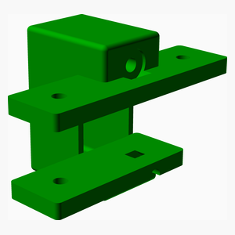 

### Sub-assemblies

| 1 x right_inner_idler_assembly |
|---|
|  

### Assembly instructions
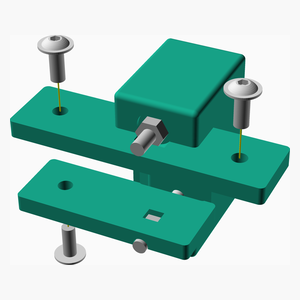

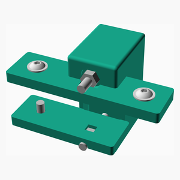

[Top](#TOP)

---

## 2 x Double Idler Assembly
### Vitamins
|Qty|Description|
|---:|:----------|
|8| Ball bearing F623-2RS 3mm x 10mm x 4mm|
|14| Washer  M3 x 7mm x 0.5mm|

### Assembly instructions

[Top](#TOP)

---

## Right Motor Assembly
### Vitamins
|Qty|Description|
|---:|:----------|
|1| Pulley GT2OB 20 teeth|
|4| Screw M3 cap x 35mm|
|5| Screw M4 flanged x 10mm|
|1| Stepper motor NEMA17 x 47mm (5x24 shaft)|
|4| Washer  M3 x 7mm x 0.5mm|
|5| Washer  M4 x 9mm x 0.8mm|

### 3D Printed parts

| 1 x [right_lower_motor_mount.stl](stls/right_lower_motor_mount.stl) | 1 x [right_motor_mount.stl](stls/right_motor_mount.stl) |
|---|---|
|  |  

### Sub-assemblies

| 1 x double_idler_assembly | 1 x idler_assembly |
|---|---|
|  |  

### Assembly instructions
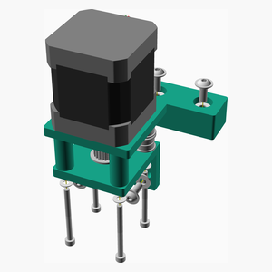

[Top](#TOP)

---

## Left Motor Assembly
### Vitamins
|Qty|Description|
|---:|:----------|
|1| Pulley GT2OB 20 teeth|
|4| Screw M3 cap x 35mm|
|5| Screw M4 flanged x 10mm|
|1| Stepper motor NEMA17 x 47mm (5x24 shaft)|
|4| Washer  M3 x 7mm x 0.5mm|
|5| Washer  M4 x 9mm x 0.8mm|

### 3D Printed parts

| 1 x [left_lower_motor_mount.stl](stls/left_lower_motor_mount.stl) | 1 x [left_motor_mount.stl](stls/left_motor_mount.stl) |
|---|---|
|  |  

### Sub-assemblies

| 1 x double_idler_assembly | 1 x idler_assembly |
|---|---|
|  |  

### Assembly instructions

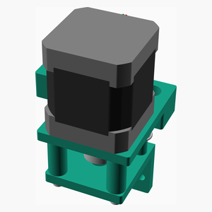

[Top](#TOP)

---

## X Carriage Insert Assembly
### Vitamins
|Qty|Description|
|---:|:----------|
|4| Heatfit insert M3 x 4mm|

### 3D Printed parts

| 1 x [x_carriage.stl](stls/x_carriage.stl) |
|---|
|  

### Assembly instructions
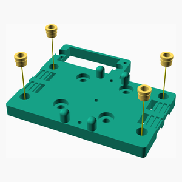

[Top](#TOP)

---

## X Carriage Assembly
### Vitamins
|Qty|Description|
|---:|:----------|
|4| Screw M3 cap x 10mm|

### 3D Printed parts

| 2 x [x_belt_clamp.stl](stls/x_belt_clamp.stl) |
|---|
| 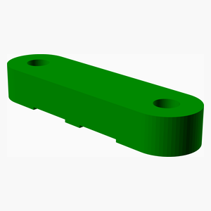 

### Sub-assemblies

| 1 x x_carriage_insert_assembly |
|---|
|  

### Assembly instructions

[Top](#TOP)

---

## X Rail Assembly
### Vitamins
|Qty|Description|
|---:|:----------|
|1| Extrusion E2020 x 450mm|
|1| Linear rail MGN12 x 400mm|
|1| Linear rail carriage MGN12H|

### Sub-assemblies

| 1 x x_carriage_assembly |
|---|
|  

### Assembly instructions

[Top](#TOP)

---

## Back Frame Assembly
### Vitamins
|Qty|Description|
|---:|:----------|
|1| Extrusion E2040 x 472mm|

### Assembly instructions

[Top](#TOP)

---

## Front Frame Assembly
### Vitamins
|Qty|Description|
|---:|:----------|
|1| Extrusion E2040 x 472mm|

### Assembly instructions

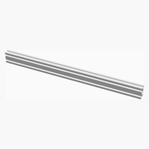

[Top](#TOP)

---

## Right Y Carriage Assembly
### Vitamins
|Qty|Description|
|---:|:----------|
|2| Nut M4 x 3.2mm |
|2| Screw M3 cap x 45mm|
|1| Screw M4 flanged x 10mm|
|1| Screw M4 flanged x 16mm|
|2| Washer  M3 x 7mm x 0.5mm|
|2| Washer  M4 x 9mm x 0.8mm|

### 3D Printed parts

| 1 x [right_lower_y_carriage.stl](stls/right_lower_y_carriage.stl) | 1 x [right_y_carriage.stl](stls/right_y_carriage.stl) |
|---|---|
| 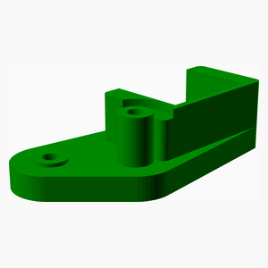 | 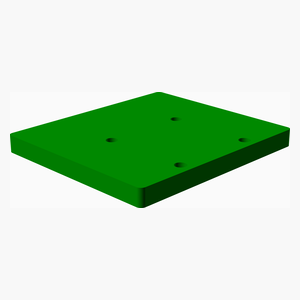 

### Sub-assemblies

| 2 x idler_assembly |
|---|
|  

### Assembly instructions

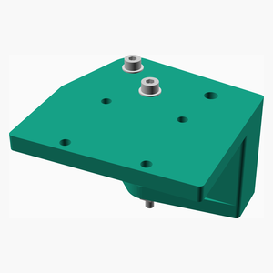

[Top](#TOP)

---

## 2 x Y Rail Assembly
### Vitamins
|Qty|Description|
|---:|:----------|
|2| Extrusion E2040 x 354mm|
|2| Linear rail MGN15 x 300mm|
|2| Linear rail carriage MGN15H|

### Assembly instructions

[Top](#TOP)

---

## Right Y Rail Assembly
### Vitamins
|Qty|Description|
|---:|:----------|
|4| Screw M3 cap x 10mm|
|4| Washer  M3 x 7mm x 0.5mm|

### Sub-assemblies

| 1 x right_y_carriage_assembly | 1 x y_rail_assembly |
|---|---|
|  |  

### Assembly instructions

[Top](#TOP)

---

## Left Y Carriage Assembly
### Vitamins
|Qty|Description|
|---:|:----------|
|2| Nut M4 x 3.2mm |
|2| Screw M3 cap x 45mm|
|1| Screw M4 flanged x 10mm|
|1| Screw M4 flanged x 16mm|
|2| Washer  M3 x 7mm x 0.5mm|
|2| Washer  M4 x 9mm x 0.8mm|

### 3D Printed parts

| 1 x [left_lower_y_carriage.stl](stls/left_lower_y_carriage.stl) | 1 x [left_y_carriage.stl](stls/left_y_carriage.stl) |
|---|---|
|  |  

### Sub-assemblies

| 2 x idler_assembly |
|---|
|  

### Assembly instructions
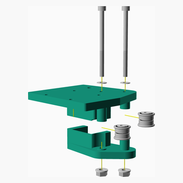

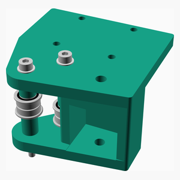

[Top](#TOP)

---

## Left Y Rail Assembly
### Vitamins
|Qty|Description|
|---:|:----------|
|4| Screw M3 cap x 10mm|
|4| Washer  M3 x 7mm x 0.5mm|

### Sub-assemblies

| 1 x left_y_carriage_assembly | 1 x y_rail_assembly |
|---|---|
|  |  

### Assembly instructions
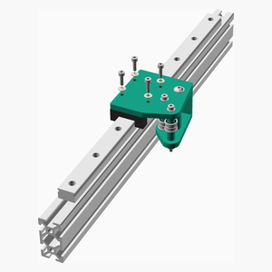

[Top](#TOP)

---

## Main Assembly
### Vitamins
|Qty|Description|
|---:|:----------|
|1| Belt GT2 x 6mm x 1522mm|
|1| Belt GT2 x 6mm x 1522mm|

### Sub-assemblies

| 1 x back_frame_assembly | 1 x front_frame_assembly | 1 x left_motor_assembly |
|---|---|---|
|  |  |  

| 1 x left_y_rail_assembly | 1 x right_idler_assembly | 1 x right_motor_assembly |
|---|---|---|
|  |  |  

| 1 x right_y_rail_assembly | 1 x x_rail_assembly |
|---|---|
|  |  

### Assembly instructions
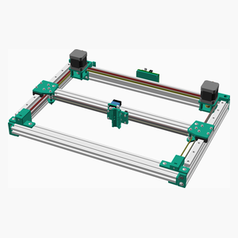

Insert PSU

[Top](#TOP)
